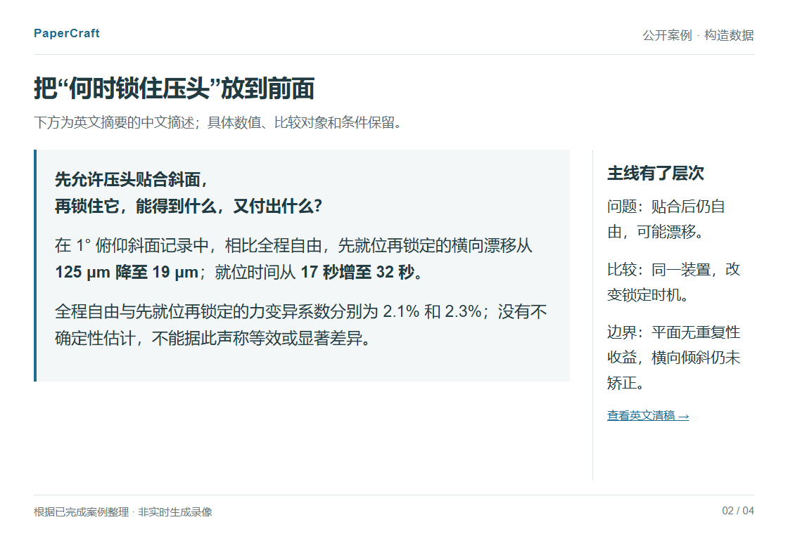

# PaperCraft｜论文叙事与精修

从已有稿件、实现说明和结果表中提炼贡献，把技术难点与证据讲顺，交付可继续修改的 Word 稿。

这是一个 **Codex skill**，适合研究已有基础、文章还没把价值讲清楚的情况。可以改全文，也可以只改摘要、引言或一段难读的方法说明。

[看改写示例](#看一段改写) · [开始使用](#开始使用) · [历史版本 2.30.1](https://github.com/zlsjtj/PaperCraft/releases/tag/v2.30.1) · [科研绘图 FigureCraft](https://github.com/zlsjtj/FigureCraft)

## 32 秒看一个完整案例

[](docs/quick-tour/tour.gif)

[播放动图](docs/quick-tour/tour.gif) · [静态逐步版与文件链接](docs/quick-tour/README.md)

演示整理自下方已完成的公开案例，使用构造材料，不是实时生成录像。静态版可以慢慢看，每一步都能回到原文件。

## 看一段改写

一个压头锁止时序的例子。原稿有部件、步骤和九行结果，但读者很难看出这些比较为什么值得做。下面是英文稿的中文摘述；**数据为教学构造值，不是真实实验**。

**原稿：列出做了什么**

> 比较了现有压头的三种操作模式，记录包含九行结果。在倾斜条件下，L 模式的力变异系数为 2.3%，横向漂移为 19 μm，就位时间为 32 秒。其他条件也有差异。

**改稿：先把问题和取舍讲明白**

> 可转动的压头能贴合斜面，但加载时继续保持自由，也可能产生横向漂移。关键在于何时锁住它。在给定斜面记录中，先就位再锁定，相比全程自由，漂移从 125 μm 降至 19 μm，就位时间则从 17 秒增至 32 秒。平面条件没有重复性收益，另一方向的斜面也未得到矫正。

读者现在能看见研究问题、有效的比较和付出的代价。方法部分再解释为何需要预载保持、为何锁定时不能抬起压头；这些工作有了理由，也有对应的证据。

[原始材料](examples/clamp-timing/input/rough.txt) · [清稿 PDF](examples/clamp-timing/clean.pdf) · [黄色审阅稿 PDF](examples/clamp-timing/review.pdf) · [Word 与重建源码](examples/clamp-timing/README.md)

这是一个经过审阅和修正的完整案例。不同版本的优缺点及首次产物保留在[对照记录](examples/clamp-timing/comparison/model-review.md)中。

## 它具体改什么

| 稿件中的问题 | 修改重点 |
|---|---|
| 摘要写满了步骤，贡献却不突出 | 从材料中区分继承工作与新增设计，把问题、变化和关键证据前置 |
| 做了很多实现与验证，读起来像清单 | 解释具体困难、必要的设计决定，以及每组验证解决了什么疑问 |
| 图、图注和正文各讲各的 | 重新分配解释任务，让主图与论文主线对应；绘图可配合 FigureCraft |
| Word 已有公式、引用和历史修改 | 修改可支持的文字区域，保留受保护对象，输出独立清稿和审阅稿 |

改稿通常附一份简短中文说明：改了哪里、依据是什么、还有什么问题。黄色表示本轮文字改动，**不是 Word 原生修订**；已有修订不会被静默接受。

## 开始使用

在可以读写本地文件的 Codex 环境中使用。安装前请查看[许可说明](LICENSE.md)，已有同名技能目录时先备份。

用 PowerShell 安装当前默认分支，包含 MIT 许可证：

```powershell
$skillRoot = if ($env:CODEX_HOME) { Join-Path $env:CODEX_HOME 'skills' } else { Join-Path $env:USERPROFILE '.codex/skills' }
New-Item -ItemType Directory -Force -Path $skillRoot | Out-Null
git clone https://github.com/zlsjtj/PaperCraft.git (Join-Path $skillRoot 'paper-evidence-framing')
```

也可以[下载当前源码 ZIP](https://github.com/zlsjtj/PaperCraft/archive/refs/heads/main.zip)，解压后将仓库文件夹改名为 `paper-evidence-framing`，放入 `~/.codex/skills/`；设置了 `CODEX_HOME` 时使用它下面的 `skills/` 目录。

在新的 Codex 会话中提供稿件和相关材料，然后这样说：

```text
使用 $paper-evidence-framing 修改这份论文。
先判断最值得突出的贡献，让摘要和引言更快讲清问题、差异与证据，
把必要的技术工作写充分。保留数据、公式和负结果，不扩大结论。
交付独立清稿、黄色审阅稿，以及简短的中文改动说明。
```

第一次可以只试摘要和引言，满意后再处理全文。除了论文，尽量提供实现说明、结果表和图源；缺少的证据会单独标明，已有依据的内容仍可继续修改。

Word 工具需要 Python 依赖，PDF 另需文档渲染环境。安装和命令见[进阶使用](docs/usage.md)。

## 更多可检查的例子

- [复杂 Word 中只改一句话](examples/complex-word/README.md)：保留公式、斜体、交叉引用、超链接和历史修订。
- [三种提示方式的改写对照](examples/three-way-reading-demo/README.md)：看不同写法实际得到和失去了什么。
- [箱角解锁案例](examples/bin-latch/README.md)：从原始材料到前后稿，包含图形、源码与评阅。

## 使用边界与反馈

它帮助已有研究得到更清楚的表达，不补造实验、引用或创新，也不保证录用。示例中的模型评阅与技术检查都可查阅；没有把它们写成真人审稿认可。

如果有一段改稿反而更难读，或一个重要限定被遗漏，欢迎[提交 Issue](https://github.com/zlsjtj/PaperCraft/issues/new)。附上允许公开的最小片段、期望效果和实际结果即可；未发表稿件请勿直接贴进公开 Issue。

觉得这些例子有用，可以点个 **Star** 留着下次改稿时用。

[测试与验证](docs/usage.md#示例与检查) · [来源说明](references/video-source-notes.md) · [许可说明](LICENSE.md)

自有代码、技能说明和原创示例采用 [MIT 许可](LICENSE)。第三方内容遵循各自许可，详见[许可说明](LICENSE.md)。技能内容版本为 2.30.1；历史发布的文件清单对应其固定 Git 标签。
