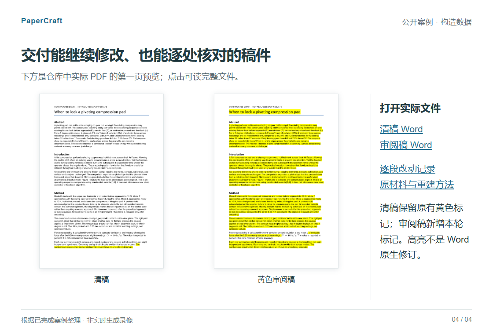

# PaperCraft｜论文叙事与精修

从研究材料中提炼贡献、讲清技术难点，交付可继续修改的 **Word 清稿、黄色审阅稿和 PDF**。

**[拿公开材料试一次](docs/first-use.md)** · [安装技能](docs/install.md) · [看实际 Word / PDF](#打开实际文件)

## 从步骤清单到研究问题

一个压头锁止时序的例子。原稿列出了操作模式和结果，却没先解释这些比较为什么值得做。以下是英文稿的中文摘述，**数字为教学构造值，不是真实实验**。

**原稿**

> 比较了现有压头的三种操作模式，记录包含九行结果。在倾斜条件下，L 模式的力变异系数为 2.3%，横向漂移为 19 μm，就位时间为 32 秒。其他条件也有差异。

**改稿**

> 可转动的压头能贴合斜面，但加载时继续保持自由，也可能产生横向漂移。关键在于何时锁住它。在给定斜面记录中，先就位再锁定，相比全程自由，漂移从 125 μm 降至 19 μm，就位时间则从 17 秒增至 32 秒。平面条件没有重复性收益，另一方向的斜面也未得到矫正。

改稿先提出“何时锁住压头”，再用同一条件下的比较讲清收益与代价。预载保持、锁定时不抬起压头等工作，在方法部分接着解释为什么必要。

[读清稿 PDF](examples/clamp-timing/clean.pdf) · [看黄色修改](examples/clamp-timing/review.pdf) · [原始材料](examples/clamp-timing/input/rough.txt) · [案例与源码](examples/clamp-timing/README.md)

## 开始使用

这是在 Codex 等 AI 工具中使用的技能，需要所用工具能够读写文件、执行代码。

第一次先只改标题和摘要。[下载公开材料包](docs/downloads/paper-evidence-framing-first-use.zip)，解压后把 TASK.md 和 input/ 交给所用工具；无需先上传自己的论文。

| 你使用的工具 | 安装入口 |
|---|---|
| Codex | [本地安装](docs/install.md#codex) |
| Claude Code | [本地安装](docs/install.md#claude-code) |
| Claude 网页 / Desktop | [上传技能 ZIP](docs/install.md#claude-web) |
| WorkBuddy | [上传技能 ZIP](docs/install.md#workbuddy) |

Codex 已有本地产出；Claude 与 WorkBuddy 的包已检查，客户端实测待完成。[具体范围](docs/multihost-validation.md)

安装后，有自己的材料可以这样说：

```text
使用 paper-evidence-framing。
先只改这份稿件的标题和摘要。
结合原稿、实现说明和结果表，
讲清问题、新增设计、关键证据与代价。
保留数据和结论边界。
给我独立 Word 清稿、黄色审阅稿和 PDF。
```

需要自己运行脚本或处理导出问题时，再看[依赖与命令](docs/usage.md)。准备材料的脚本不调用模型；实际改稿由你使用的 AI 工具完成。

## 打开实际文件

[清稿 Word](examples/clamp-timing/clean.docx) · [审阅稿 Word](examples/clamp-timing/review.docx) · [清稿 PDF](examples/clamp-timing/clean.pdf) · [审阅稿 PDF](examples/clamp-timing/review.pdf)

黄色表示本轮改写，**不是 Word 原生修订**；案例保留原有标记及修改记录。

<details>
<summary>预览清稿与黄色审阅稿</summary>

[](examples/clamp-timing/README.md)

缩略图展示文件外观，正文请打开上方 PDF 阅读。[32 秒案例导览](docs/quick-tour/tour.gif)是已完成案例的展示，不是实时生成录像。

</details>

## 换一种稿件问题

- 实现工作很多，却像操作清单：[快照所有权的方法段](examples/heat-story/README.md)。
- 结果不少，容易把收益归错原因：[有界缓存的前后稿](examples/cache-reserve/README.md)。
- Word 含公式、链接和历史修改：[只改一句话的例子](examples/complex-word/README.md)。

[更多案例](docs/examples.md) · [改写教程](docs/from-materials-to-paper.md) · [普通提示与技能的同材料对照](examples/window-records-trial/README.md)

## 使用边界与反馈

已有研究是基础；PaperCraft 不补造实验、引用或创新，也不保证录用。公式、表格和必要限定需要随最终稿核对。公开案例使用构造材料，效果评阅来自模型，不能代替作者判断。[验证记录](docs/usage.md#示例与检查)

遇到难用的地方，欢迎[提交反馈](https://github.com/zlsjtj/PaperCraft/issues/new?template=usage.yml)：用的工具、想改的段落、实际哪里不对。一个允许公开的小片段就够，不必上传未发表全文。

如果它帮你把论文讲清楚了，欢迎点一个 Star，留着下次改稿时用。科研图可配合 [FigureCraft](https://github.com/zlsjtj/FigureCraft)。

原创代码与文字采用 [MIT](LICENSE) 许可；第三方内容见[许可说明](docs/licensing.md)。
