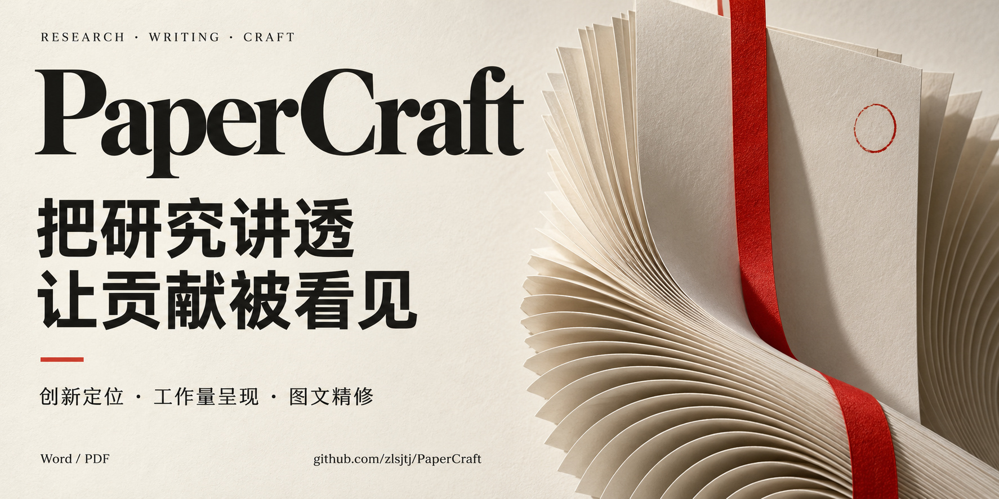
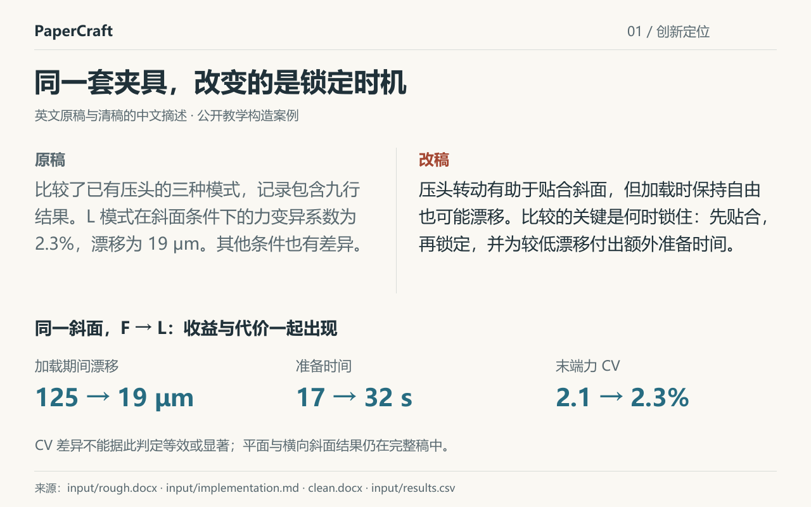

<p align="center">
  <a href="docs/social-preview/README.md"></a>
</p>
<p align="center"><a href="#改写效果">看改写效果</a> · <a href="#开始使用">下载安装</a> · <a href="docs/examples.md">案例与源码</a> · <a href="LICENSE">MIT</a></p>

给 AI 研究助手使用的论文精修技能。从原稿、实现说明和结果中找到值得讲的主线，把**做了什么**写成**为什么值得做、难在哪里、证据支持什么**。从标题、摘要到方法与结果，最后交付可继续编辑的 **Word 清稿、黄色审阅稿和 PDF**。

## 改写效果

[](examples/clamp-timing/showcase/README.md)

**先抓住选择，再讲工作与证据。** 可转动的压头能贴合斜面，但加载时继续保持自由也可能漂移。改稿将“何时锁住”前置，把收益、代价和必要操作串成一条论证。

**[完整前后对照](examples/clamp-timing/showcase/README.md)** · [技术工作怎样写](examples/clamp-timing/showcase/README.md#2-把操作写成必要的决定) · [读清稿 PDF](examples/clamp-timing/clean.pdf) · [看黄色审阅 PDF](examples/clamp-timing/review.pdf)

<sub>英文案例的中文摘述；数值为教学构造数据。</sub>

[Word 清稿](examples/clamp-timing/clean.docx) · [Word 审阅稿](examples/clamp-timing/review.docx) · [原始材料](examples/clamp-timing/input/rough.docx) · [30 秒案例导览](examples/clamp-timing/showcase/assets/tour.gif)

## 用在你的论文里

| 想让读者看见什么 | PaperCraft 怎么改 | 看实际案例 |
|---|---|---|
| **创新点** | 找到研究约束与实际改变，把主贡献前置 | [锁定时机：从步骤清单到设计问题](examples/clamp-timing/README.md) |
| **技术工作** | 用难点、必要决定和验证作用解释实现工作 | [快照所有权：把工程工作写进论证](examples/heat-story/README.md) |
| **证据与取舍** | 让每项收益有对照、有归因，也讲清代价 | [有界缓存：组织混合结果](examples/cache-reserve/README.md) |
| **成稿交付** | 保留公式、引用与历史标记，生成可审阅的修改文件 | [复杂 Word：局部修改与对象保全](examples/complex-word/README.md) |

[同材料生成对照](examples/window-records-trial/README.md) · [从材料到成稿的教程](docs/from-materials-to-paper.md)

## 开始使用

选择你使用的 AI 客户端，安装技能后交给它材料：

- **Claude 网页 / Desktop**：[下载技能 ZIP](https://github.com/zlsjtj/PaperCraft/releases/download/v2.31.1/paper-evidence-framing-claude.zip) · [导入说明](docs/install.md#claude-web)
- **WorkBuddy**：[下载技能 ZIP](https://github.com/zlsjtj/PaperCraft/releases/download/v2.31.1/paper-evidence-framing-workbuddy.zip) · [导入说明](docs/install.md#workbuddy)
- **Claude Code**：[插件安装，两条命令](docs/install.md#claude-code)
- **Codex**：[安装到技能目录](docs/install.md#codex)

**先试一个摘要：**[下载示例材料](https://github.com/zlsjtj/PaperCraft/releases/download/v2.31.1/paper-evidence-framing-first-use.zip)，解压后把 `TASK.md` 和 `input/` 交给客户端。技能 ZIP 保持压缩状态导入；示例材料 ZIP 解压后使用。

有自己的原稿，可以直接说：

```text
使用 paper-evidence-framing，先改这份论文的标题和摘要。
结合原稿、实现说明和结果表，自行判断什么应当前置。
讲清新增设计、关键难点、证据与代价；保留结论边界。
交付独立 Word 清稿、黄色审阅稿和 PDF。
```

[完整使用教程](docs/first-use.md) · [安装与常见问题](docs/install.md) · [导出与运行依赖](docs/usage.md)

## 一起打磨好论文

遇到一段难写的论证，欢迎[带着具体例子提 Issue](https://github.com/zlsjtj/PaperCraft/issues/new?template=usage.yml)：你想表达什么、用了哪个工具、哪一处仍读不顺。用允许公开的小片段就能讨论。

**觉得有用，点个 Star，留给下一次改稿。** 科研配图可搭配 [FigureCraft](https://github.com/zlsjtj/FigureCraft)。

原创部分采用 [MIT](LICENSE)；[第三方许可](docs/licensing.md)、[实现与验证记录](docs/client-entry-validation.md)另列。
