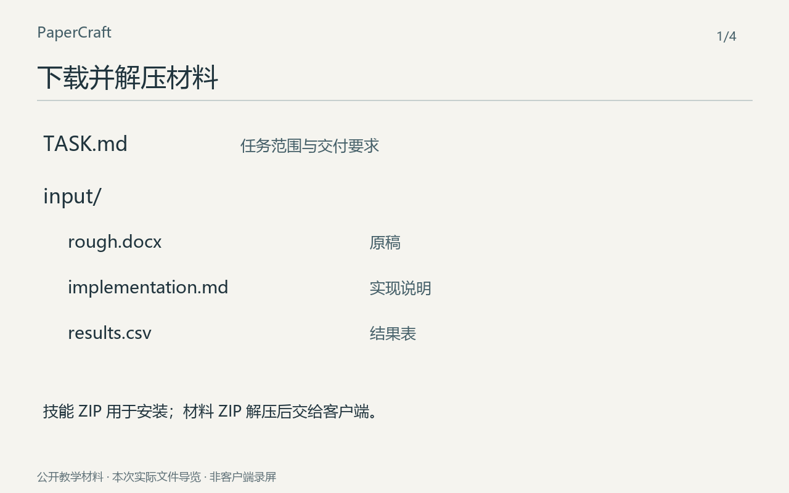

# 从下载包到成品：一次完整试用

先跟着做一个小任务，再决定怎样用在自己的研究里。这里的材料和成品都可以下载。

[](tour.gif)

[逐步看静态图](frames/) · 点击动图可打开大图。

动图由本次输入和实际导出文件编排，是操作导览，不是客户端录屏，也不表示实际生成耗时。材料与数值均为教学构造。

## 1. 准备材料

[下载公开试用包](https://github.com/zlsjtj/PaperCraft/releases/download/v2.31.1/paper-evidence-framing-first-use.zip)，解压得到 `TASK.md` 和 `input/`。先按[安装说明](../install.md)启用技能；技能包用于安装，材料包用于这次任务。

本地客户端打开任务文件夹；使用附件的客户端同时提供 `TASK.md` 和 `input/` 中的文件。原始文件也保存在[这里](input/)。

## 2. 发出任务

```text
使用 PaperCraft（paper-evidence-framing）。
按 TASK.md 处理 input/ 中的材料，
将结果另存到 output/，保留原文件。
```

等待客户端完成材料阅读、标题与摘要修改、导出和检查。材料准备脚本只复制输入，不会自动调用模型。新任务会得到自己的生成结果，不要求与下面的改稿逐字相同。

## 3. 打开成品

[Word 清稿](output/clean.docx) · [黄色审阅稿](output/review.docx) · [清稿 PDF](output/clean.pdf) · [审阅 PDF](output/review.pdf)

原稿从组件和记录数量说起；这次摘要先说明“贴合需要自由、加载又需要稳定”，再交代锁定顺序、力变异、漂移与准备时间。平面与跨轴倾斜的边界仍在。

## 4. 对照自己的结果

实际只改了第 2、4 段，即标题与摘要。其他段落 XML 和所有其他 DOCX 部件逐一相同，因而原公式、表格、链接、原有黄标都保留；清稿与审阅稿各两页，已逐页查看。黄色只呈现本轮新文字，不是 Word 原生修订。图占位来自原稿，本次局部任务未改它。

本次自修：初稿标题列了过多指标，摘要重复解释将 Sources 挤到第三页；保留首稿补丁后压缩成单行标题与较短摘要，恢复两页，未改正文或字号。

先检查摘要是否讲清问题、改动与证据，再调整措辞。想继续修改时，指出具体文件与问题，例如“把摘要中的准备时间代价和漂移收益接起来”。

## 重建这次成品

下面重建已经写好的补丁或图源，不是再调用模型。在仓库根目录运行，输出必须是新路径；依赖见[运行说明](../usage.md)。

```text
python docs/first-run/rebuild.py --skill . --out ../paper-rebuilt
python scripts/render_review.py ../paper-rebuilt/clean.docx ../paper-rebuilt/clean-pages --backend standalone
python scripts/render_review.py ../paper-rebuilt/review.docx ../paper-rebuilt/review-pages --backend standalone
```

这次在 Codex 桌面当前会话中读取公开下载包完成，由维护模型审阅。材料此前已有案例，因此不是陌生材料盲测；也不是 Claude / WorkBuddy 客户端实录。来源、文件内容标识和检查范围见 [run.json](run.json)。原先候选保存在 [retained](retained/)。

[不播放动图，逐步看静态图](frames/) · [回到首次使用说明](../first-use.md)
