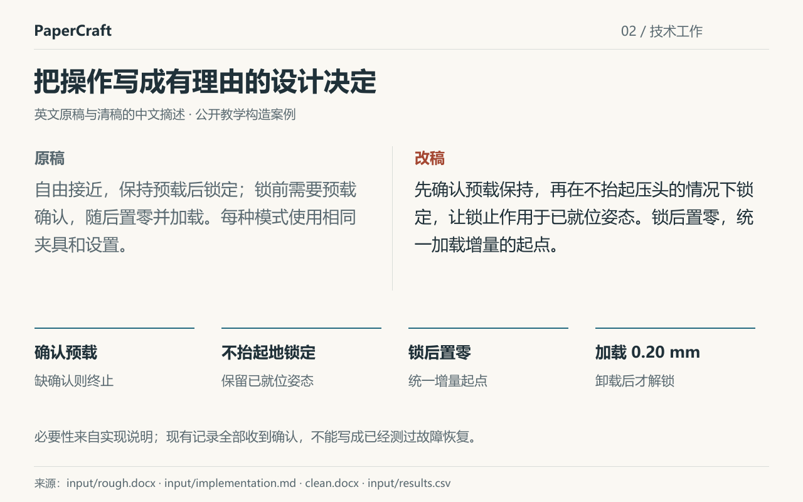

# 把步骤清单改成有重点的论文摘要

原稿列出了三种模式、九行结果，还有 2.3%、19 μm、32 秒。数字不少，读者却不容易看出作者究竟在比较什么。

PaperCraft 从原稿、实现说明和结果中找主线，再将它写进论文。这个案例的改变是：先解释**何时锁住压头**，再讲操作、比较与证据。

[](../examples/clamp-timing/showcase/README.md)

*英文案例的中文摘述。材料与九行数值均为教学构造，不是真实实验结果。*

## 先让比较有理由

压头能转动，有助于贴合斜面；加载时继续保持自由，又可能发生横向漂移。读者理解这个矛盾后，才知道为什么要比较锁定时机。

在同一斜面条件下，先就位再锁定，相比全程自由，漂移从 125 μm 降至 19 μm，就位时间从 17 秒增至 32 秒。末端力 CV 从 2.1% 到 2.3%，不能据此判定等效或显著。平面没有重复性收益，另一方向的斜面也未得到矫正。

已有转动部件仍归为已有结构。读者先看到实际设计选择，随后看到收益、代价和适用条件。

## 把技术工作写出必要性

预载确认、不抬起压头地锁定、锁后置零，原本只是三条步骤。方法段接着解释：先确认就位状态，保持接触完成锁定，再统一加载增量的起点。这让读者知道操作顺序为什么不能随意互换。

[](../examples/clamp-timing/showcase/README.md#2-把操作写成必要的决定)

“缺确认则终止”来自实现说明；这组记录没有发生缺确认，不能把它写成已经验证故障恢复。真实工作得到呈现，证据边界也仍在。

## 最后看完整稿

**[清稿 PDF](../examples/clamp-timing/clean.pdf)** · [黄色审阅 PDF](../examples/clamp-timing/review.pdf) · [Word 清稿](../examples/clamp-timing/clean.docx) · [Word 审阅稿](../examples/clamp-timing/review.docx) · [原稿和结果表](../examples/clamp-timing/README.md#用什么材料)

标题、摘要、方法、结果和限制都在同一份稿中。黄色标出文字改写，与 Word 原生修订分开；原有标记保留。

[完整三步对照](../examples/clamp-timing/showcase/README.md) · [30 秒案例导览](../examples/clamp-timing/showcase/assets/tour.gif)。导览由已完成文件制作，不是实时生成录像。

## 自己试一次

[按客户端安装](install.md)，再[下载公开材料并开始](first-use.md)。第一次只改标题和摘要，先看看它能否抓住研究选择；有自己的材料时，可以这样发任务：

```text
使用 paper-evidence-framing，结合原稿、实现说明和结果表，先改标题与摘要。
自行判断最值得前置的贡献，讲清问题、必要决定、收益与代价。
保留结论边界，将 Word 清稿、黄色审阅稿和 PDF 另存，保留原件。
```

完成后，先检查主贡献是否更容易找到、结果是否归因正确，再核对导出文件。有具体的进步或问题，都可以[留一条使用反馈](https://github.com/zlsjtj/PaperCraft/issues/new?template=usage.yml)。

<details>
<summary>复制短介绍，分享这个案例</summary>

```text
论文材料齐了，摘要却还在列步骤。PaperCraft 会结合原稿、实现说明和结果，提炼值得前置的贡献，把必要技术工作和证据讲清楚，交付 Word 清稿、黄色审阅稿和 PDF。

仓库里可以直接看同一份材料的前后对照，也能下载公开材料试改。提供 Claude、Codex、WorkBuddy 安装入口，原创部分采用 MIT 许可。
https://github.com/zlsjtj/PaperCraft
```

配图用[实际改写对照](https://raw.githubusercontent.com/zlsjtj/PaperCraft/main/examples/clamp-timing/showcase/assets/contribution.png)；想重点讲技术工作，可换[方法段对照](https://raw.githubusercontent.com/zlsjtj/PaperCraft/main/examples/clamp-timing/showcase/assets/engineering.png)。图中教学构造声明请一并保留。

</details>
