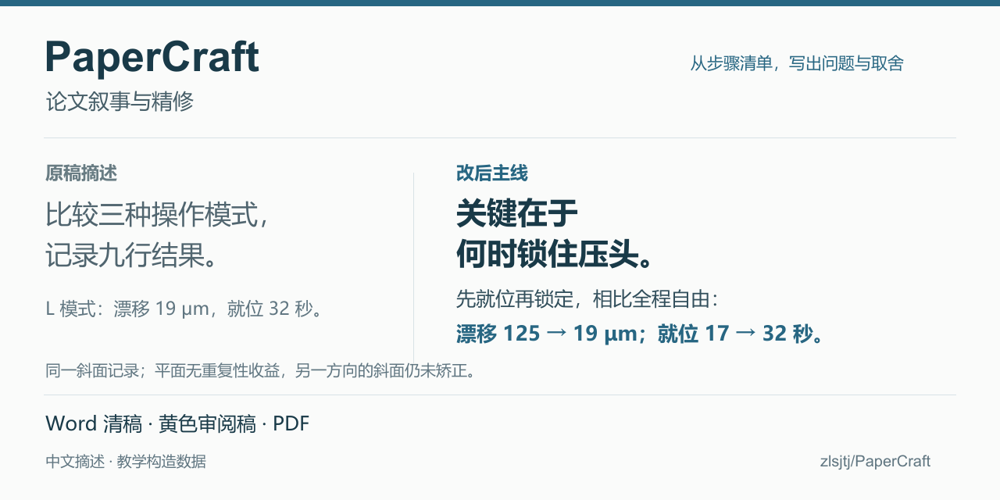

# 同一份研究材料，怎样把贡献写到前面？

部件、步骤和结果都写齐了，读者却还不知道这项研究解决了什么问题。PaperCraft 从原稿、实现说明和结果表里提炼主线，再把它落实到标题、摘要、方法和结果中。

[](../examples/clamp-timing/README.md)

*公开教学案例；图中数值为构造数据。*

## 把读者最想知道的问题提前

原稿先报“三种操作模式、九行结果”，接着列出 2.3%、19 μm、32 秒。实现说明里却埋着一个值得先讲的问题：压头能转动以贴合斜面，但加载时继续保持自由，也可能产生横向漂移。

**关键在于何时锁住压头。** 把这句话提前，后面的比较就有了理由：在同一斜面条件下，先就位再锁定，相比全程自由，漂移从 125 μm 降到 19 μm，就位时间从 17 秒增加到 32 秒。平面条件没有重复性收益，另一方向的斜面也未得到矫正。

原有转动部件仍是已有结构；新增做法、有效比较和代价，现在有了各自的位置。

## 让技术工作有理由、有证据

预载保持、锁定时不抬起压头，原本可以写成两条操作步骤。方法段进一步说明：这些动作共同维持已建立的接触状态，让压头从就位进入固定加载。

读者因此能理解这些工程决定为什么必要。具体操作留在方法中，摘要先交代问题、改变及主要证据。

**[打开清稿 PDF](../examples/clamp-timing/clean.pdf)** · [看黄色修改](../examples/clamp-timing/review.pdf) · [可编辑 Word](../examples/clamp-timing/clean.docx) · [原稿与逐段对照](../examples/clamp-timing/README.md)

黄色高亮显示案例中的文字改动，与 Word 原生修订分开保留。

## 用你自己的材料试一次

准备原稿、实现说明和结果表，先只改标题与摘要：

```text
使用 paper-evidence-framing，结合这份原稿、实现说明和结果表，
自行判断最值得前置的贡献。讲清问题、关键困难、实际改变和证据，
保留收益、代价与适用条件，交付 Word 清稿、黄色审阅稿和 PDF。
```

**[下载安装](https://github.com/zlsjtj/PaperCraft/releases/latest)** · [拿公开材料试用](first-use.md) · [32 秒案例导览](quick-tour/tour.gif) · [项目首页](https://github.com/zlsjtj/PaperCraft)

导览展示已完成案例的四步过程。原材料、完整条件、生成源码和改动记录均在案例页。

<details>
<summary>复制一段短介绍，分享给需要改稿的人</summary>

```text
实验和实现做了不少，摘要却像步骤清单？PaperCraft 从原稿、实现说明和结果表中提炼主线，讲清创新点、技术难点与证据，交付 Word 清稿、黄色审阅稿和 PDF。仓库有同材料改写对照，也准备了可直接试用的公开材料。Claude、Codex、WorkBuddy 都有安装入口。
https://github.com/zlsjtj/PaperCraft
```

配图：[下载分享封面](https://raw.githubusercontent.com/zlsjtj/PaperCraft/main/docs/social-preview/social-preview.png)。

</details>
