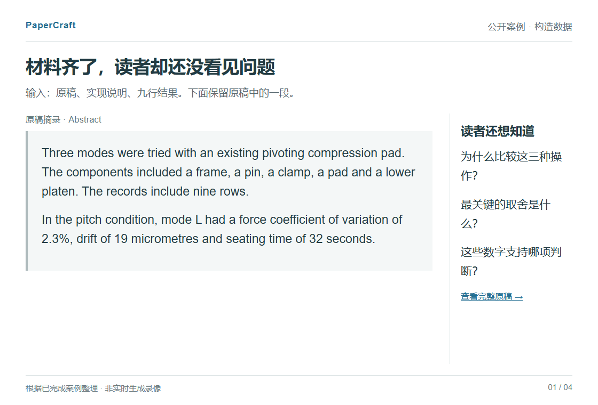
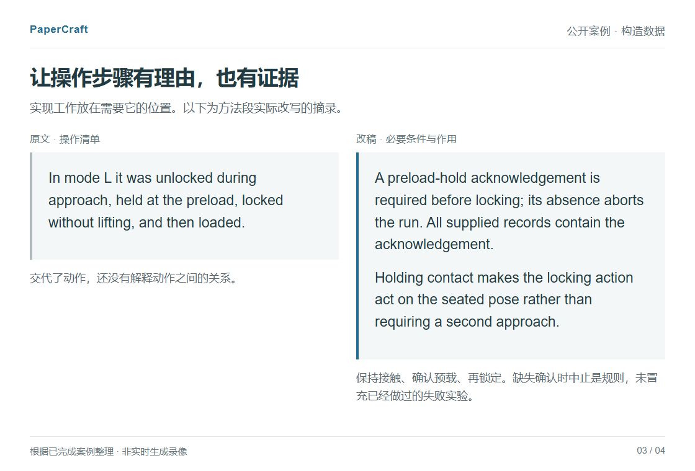

# PaperCraft：32 秒看一个完整案例

[播放动图](tour.gif) · [本地交互版](index.html) · [返回首页](../../README.md)

这是已完成案例的四步导览，不是实时生成录像。材料与数据都是原创构造示例，没有用未发表论文做宣传，也不代表所有输入都能得到同样效果。下方静态版可以逐步查看，原文件链接在最后。

下载仓库后，用浏览器打开 `index.html`，可点击数字、左右方向键，或选择自动播放。默认停在第一页；GitHub 不直接执行 HTML，请在本地打开。

## 1. 原稿里的部件、步骤和数字



## 2. 先讲锁定时机与取舍


## 3. 用必要条件解释实现工作



## 4. 实际清稿与审阅稿


## 对照实际文件

[原始材料](../../examples/clamp-timing/input/) · [清稿 PDF](../../examples/clamp-timing/clean.pdf) · [审阅稿 PDF](../../examples/clamp-timing/review.pdf) · [清稿 Word](../../examples/clamp-timing/clean.docx) · [审阅稿 Word](../../examples/clamp-timing/review.docx) · [逐段改动](../../examples/clamp-timing/authored-edits.json) · [案例与重建](../../examples/clamp-timing/README.md)

演示中的中文摘述用于帮助阅读，英文论文、科学图和数值没有被重新生成或改动。示例本身的开发过程与模型评阅仍保留在案例目录中。

## 重建演示

只查看上述文件不需要安装依赖。重新导出需要 Python、Pillow、Node.js、Playwright 和 Chrome / Chromium；PaperCraft 还需要 Poppler 的 `pdftoppm` 把现有 PDF 渲染为第一页预览。字体使用本机 Arial / 微软雅黑等，不随仓库分发；不同环境的排版和文件哈希可能不同。

在本目录执行以下命令。把路径换成自己的运行环境；输出只覆盖本目录的演示文件，不改原始示例。

```powershell
python -m pip install Pillow
npm install --prefix .tour-runtime playwright
$env:NODE_PATH = (Resolve-Path .tour-runtime/node_modules).Path
python build.py --browser "C:/Program Files/Google/Chrome/Application/chrome.exe" --pdftoppm "C:/path/to/poppler/bin/pdftoppm.exe"
```

`index.html` 是展示源码；`render.cjs` 导出四个完整浏览器画面；`build.py` 生成 32 秒 GIF、封面及 `build-record.json`。后者记录输入文件哈希、图像是否加载及导览按钮检查。它只证明展示可重建，不是论文说服力或科研图审美的评分。

动图每页停留 8 秒，总计 32 秒，无配音。可以随时改看静态版，不必按播放速度阅读。
