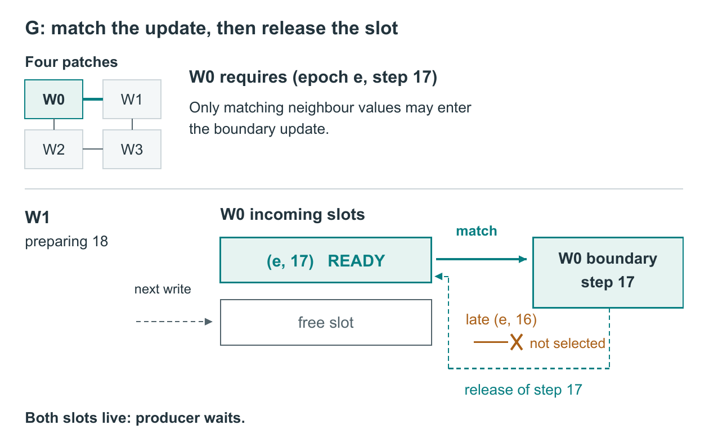
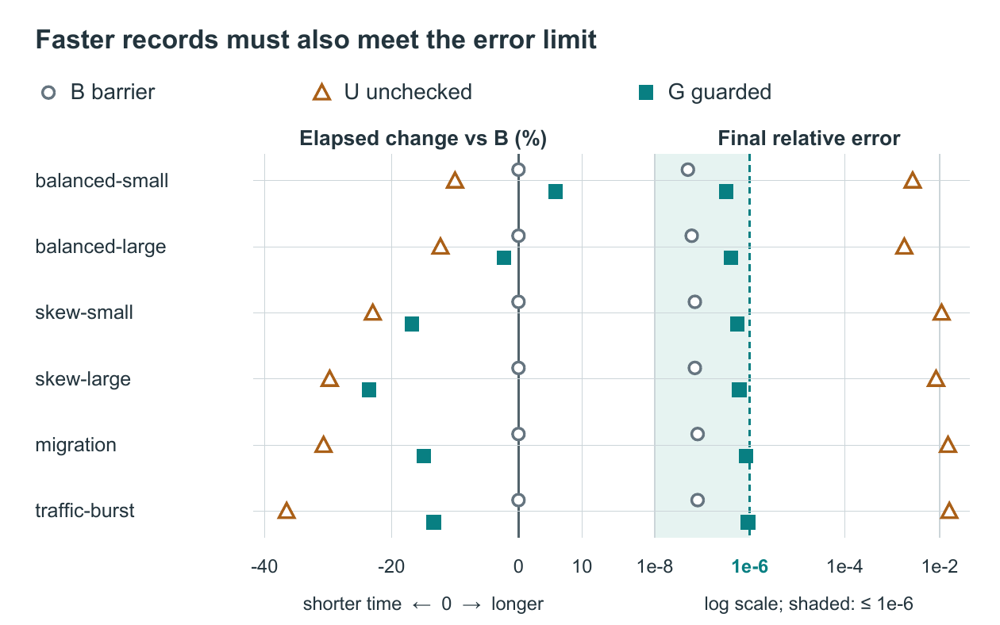

# Matching Steps and Protecting Live Values Without a Global Barrier

*Constructed DEMO: all mechanisms, traces and values are supplied teaching material; no experiment was run.*

## Abstract

Removing a diffusion solver's global barrier lets interior work overlap message travel, but the latest neighbour value may belong to the wrong step. A guarded configuration, G, pairs epoch-and-step matching with two incoming slots whose contents remain protected until release. Across six constructed cases, G meets the fixed final-error requirement in every case and shortens elapsed time in five, while costing more memory and slowing the smallest balanced case. Unchecked replacement is faster in all six but fails the error requirement throughout. The comparison supports bounded, guarded overlap under the stated conditions, without changing the numerical stencil.

## Introduction

The inherited teaching solver advances a scalar diffusion field on four rectangular patches. Its finite-volume stencil, partitioning and asynchronous work queue are unchanged. Configuration B waits at a global barrier after every step, so a producer cannot run ahead and one incoming buffer per interface suffices. Configuration U removes that barrier and uses whichever values most recently overwrote its single buffer.

The resulting question is whether local progress can replace global waiting while preserving the inputs required by each boundary update. G addresses both which value may be read and how long that value must remain available. Figure 1 separates these two obligations; Figure 2 evaluates their combined cost and benefit.

## Method

Each patch owns its interior cells and one edge ghost layer. Ghost entries are copied neighbour values, not additional physical cells. Only edge neighbours exchange them: W0 and W3, for example, do not exchange across their diagonal contact. Interior work may proceed while messages travel, but a boundary update at step k requires every applicable neighbour edge to carry the pair (partition_epoch, k).

G gives each incoming interface two slots containing values, epoch, step and a ready flag. The consumer selects a ready slot only when both labels match its required pair. A ready flag alone cannot repair U. When partition ownership changes, an earlier epoch must not authorize an update, even if its numerical step happens to match.

Matching also does not protect storage by itself. Consider the supplied illustrative interleaving: W0 needs step 17; W1 has sent step 17 and is preparing step 18; a late step-16 packet remains queued. G refuses the late value for this update and keeps step 17 live until the consumer acknowledges release. Without that lifetime constraint, a new write could replace correctly labelled data before consumption. If both slots are live, the producer waits. Two slots therefore allow bounded overlap, not unlimited advance; the notes leave obsolete-packet disposal unspecified.

If matching input remains absent beyond the existing timeout, all workers return to the last completed barrier snapshot and rerun using B. A partial G step is not completed progress, and restart can add time.

**Figure 1. Matching and lifetime are separate conditions (constructed DEMO).** The inset preserves the four-patch topology; links denote edge adjacency. The main view follows one W1-to-W0 incoming interface in G. A ready (e, 17) slot feeds W0's step-17 boundary update; a late (e, 16) value cannot be selected. The free second slot illustrates bounded capacity while W1 prepares step 18; the dashed next-write arrow denotes a possible subsequent write, not an observed arrival. Release acknowledgement permits reuse of the consumed slot. Each interface uses the same rules; a complete boundary update still needs all applicable neighbours. The example does not specify obsolete-packet disposal.

## Results

Within each case, B, U and G share the initial field, grid, partition plan, precision and 2,000 steps. The reference is serial execution of the same stencil. Eligibility requires maximum relative final-field error at most 1e-6. Elapsed time includes advance, packing, polling, boundary checks and waits, but excludes allocation and setup. Peak memory includes state and message buffers. The fixed criterion preceded these constructed values; no repeats or uncertainty estimates are available.

Balanced and skew cases use 128-by-128 (small) or 512-by-512 (large) grids. Balanced workers have comparable delays; skew cases give W1 more interior work. Migration changes the partition epoch midway on a 256-by-256 grid. Traffic-burst uses that grid size with clustered delivery delays. These categories do not form a time trajectory.

G's largest time reduction is 23.6% against B on skew-large, from 955 to 730 ms. It also reduces time by 16.8% on skew-small, 14.9% on migration and 13.4% on traffic-burst. Balanced-large improves only 2.3%, whereas balanced-small takes 127 rather than 120 ms, a 5.8% increase. Thus, removing the barrier with guards does not imply a universal speed benefit. These are whole-configuration comparisons, not isolated timings of individual checks.

All six G errors remain below the requirement; traffic-burst is closest at 9.3e-7. U is faster than both alternatives in every case, but its errors range from 1.8e-3 to 1.6e-2. Its times remain visible in Table 1 and Figure 2, while its failed eligibility prevents treating it as an accuracy-preserving improvement. G adds 9, 38 and 24 MiB for the small, large and 256-by-256 cases respectively. Extra storage is not a constant percentage across grids.

**Figure 2. Time savings and accuracy eligibility must be read together (constructed DEMO).** Each categorical workload has paired time and error displays for all three modes. Time change is 100 × (mode elapsed / B elapsed − 1); negative values mean shorter time. Error uses a logarithmic axis, with the acceptable region shaded through the fixed 1e-6 threshold. Symbols are offset vertically within each row solely for legibility, not as a further measured variable. No lines connect different workloads and no uncertainty intervals are available. All G and B rows qualify; every U row fails. Memory costs and exact values remain in Table 1; injected-timeout episodes are excluded.

*Table 1. All 18 constructed DEMO records. Time covers the advance loop and communication work, excluding setup; error is relative to the serial final field. The fixed accuracy criterion is error ≤ 1e-6.*

| Case | Mode | Elapsed (ms) | Peak (MiB) | Max. relative error | Meets criterion |
|---|---|---:|---:|---:|:---:|
| balanced-small | B | 120 | 82 | 5.0e-8 | Yes |
| balanced-small | U | 108 | 82 | 2.7e-3 | No |
| balanced-small | G | 127 | 91 | 3.2e-7 | Yes |
| balanced-large | B | 480 | 560 | 6.0e-8 | Yes |
| balanced-large | U | 421 | 560 | 1.8e-3 | No |
| balanced-large | G | 469 | 598 | 4.0e-7 | Yes |
| skew-small | B | 244 | 82 | 7.0e-8 | Yes |
| skew-small | U | 188 | 82 | 1.1e-2 | No |
| skew-small | G | 203 | 91 | 5.5e-7 | Yes |
| skew-large | B | 955 | 560 | 7.0e-8 | Yes |
| skew-large | U | 671 | 560 | 8.4e-3 | No |
| skew-large | G | 730 | 598 | 6.0e-7 | Yes |
| migration | B | 710 | 214 | 8.0e-8 | Yes |
| migration | U | 492 | 214 | 1.5e-2 | No |
| migration | G | 604 | 238 | 8.4e-7 | Yes |
| traffic-burst | B | 868 | 214 | 8.0e-8 | Yes |
| traffic-burst | U | 551 | 214 | 1.6e-2 | No |
| traffic-burst | G | 752 | 238 | 9.3e-7 | Yes |

## Boundaries and conclusion

Separate constructed checks refused prior-epoch replay in 12/12 traces and made producers wait on two live slots in 12/12. Suppressed required packets triggered fallback in 4/4; the restarted B computations met the final-error requirement, but their elapsed times were not recorded. These checks describe intended branches, not independent reliability trials. Timeout episodes are absent from the timing table.

The supported change is local input validation coupled to protected slot reuse. The examples favor it under skew and delayed delivery, while retaining a balanced-case slowdown and memory cost. They establish neither a new discretization nor optimal slot count, universal scaling, a hardware bottleneck or a long-run failure probability. Physical performance and novelty remain untested.
