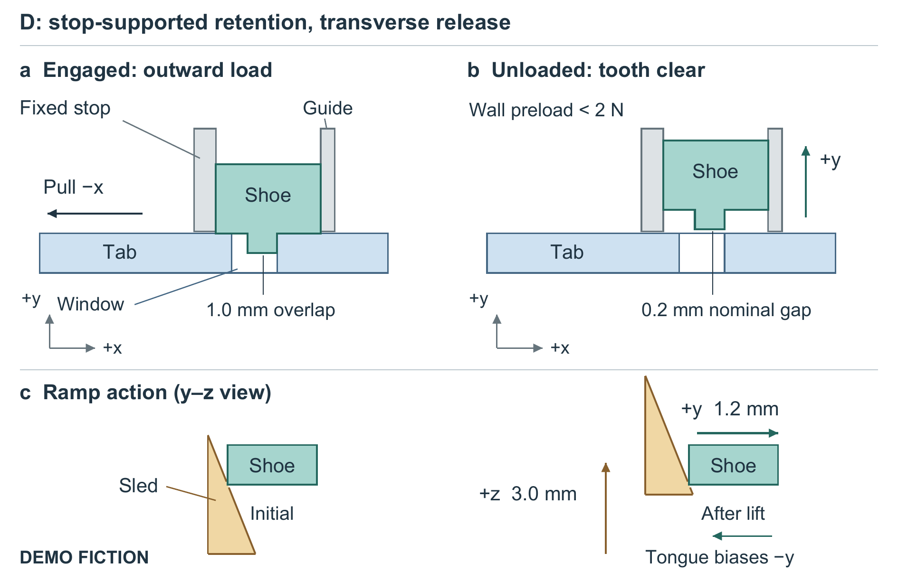

# 箱角解锁：未经预设主旨的新材料试用

全部数值为 **DEMO FICTION** 固定构造，没有真实试验或仿真。原稿、结构说明、八行结果和来源边界见 `input/`。生成者未拿到贡献答案或评审专用清单。

这是一次三条件试用：普通任务、PaperCraft 2.21/FigureCraft 1.18、候选2.22/1.19。同一材料、图宽160 mm、正文上限1800词，各自独立上下文，保留首次生成及一次自修。没有精确锁定推理预算、重复统计或真人测试。匿名模型先看同等范围前部和图，再看全文材料；U/V/W分别对应普通/旧版/新版。评价后修复另存，不倒写首评。

## 看到了什么

| 条件 | 收益 | 代价或问题 |
|---|---|---|
| 普通任务 | 结构环境和D0修订展示较多 | 图b的齿仍进入tab投影，无法直接读出释放净空；作为失败对照保留，不推荐使用 |
| 旧技能 | 接触和坐标直接，篇幅紧凑 | 换视角增加对应负担，tab的灰色身份不够鲜明 |
| 新技能 | 用同一视角对照啮合与清齿；文章提前解释保持与解锁的冲突，将失败、决定、不利位置检查连起来 | 首次摘要把整套硬件增重写成零件增重；图c初态遮挡。两项已在根目录交付版修复 |

三者都识别了主要设计权衡。没有证据说明新版全面优于旧版或达到顶刊审美。新版的作用主要是因果顺序、比较范围的可见性和状态对照；没有新增科学证据。



根目录为反馈后交付版。`comparison/`保存首次与自修产物；其中的SVG也可编辑。它们用于查明得失，不能当作全部正确的模板。匿名首读、全文审阅和知情定向复验分别在 `review-first-look.md`、`review-review.md`、`review-followup.md`。

## 从源码重建

```powershell
python -m pip install -r examples/bin-latch/requirements.txt
python examples/bin-latch/build_figure.py --out latch-output --font C:/Windows/Fonts/arial.ttf --bold-font C:/Windows/Fonts/arialbd.ttf --pdftoppm <pdftoppm.exe的完整路径>
```

输出目录必须不存在。字体和Poppler由宿主提供；SVG、矢量PDF、300dpi PNG、灰度和近似色觉预览均由本例源码重新生成。示意图没有真实比例尺，不是制造图。它用二维剖面表达接触和位移，没有借透视增加体积错觉。

## 边界

本例只支持一次未见材料生成的有限结论，评审后的版本已属于开发。没有检验研究新颖性、真实同行认可、随机重复稳定性、实体打印或所有色觉条件。主图仍偏工程说明，距离自然精致的整页科研视觉还有空间。选择二维并不代表所有题材都应扁平化；本例需要清楚读出接触和清齿。

完整成稿：[清稿PDF](documents/manuscript.pdf)、[清稿Word](documents/manuscript.docx)、[黄色审阅稿](documents/review.docx)、[审阅PDF](documents/review.pdf)。黄色相对未经整理原稿，按重写段落标记，不是原生修订。清稿与黄稿均4页；最后排版将结果与讨论共同起页，未改变首次比较产物。

文档重建：`python examples/bin-latch/build_document.py --out latch-documents --font C:/Windows/Fonts/times.ttf --bold-font C:/Windows/Fonts/timesbd.ttf`。使用同仓库heat-story中的限定Markdown构建器；原生公式/复杂历史Word应使用主技能保护工具，不能用此示例代替。Word转PDF使用宿主documents渲染器及LibreOffice，本仓库不捆绑。
