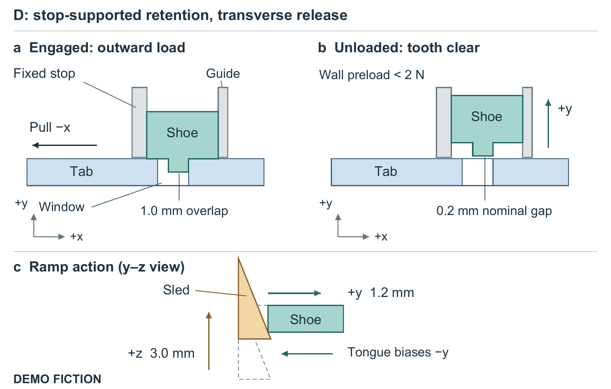

# A Stop-Supported Sliding Shoe for Unloaded Release at a Bin Corner: A Fictional Comparison

**DEMO FICTION. All devices, fixtures, outcomes, and numbers are preset constructions for a writing exercise, not physical measurements or simulation results.**

## Abstract

A removable bin corner must resist outward wall load yet open after the bin is emptied. Simply stiffening a snap can strengthen retention while making release difficult. We specify a sliding shoe whose tooth transfers the outward load to a housing stop, while an upward release sled retracts the shoe transversely after unloading. A finite fictional comparison places this mechanism beside a simple snap, a cross-pin, and a thicker snap within a common housing envelope. After 300 engaged load cycles, the shoe configuration releases in 18/20 gritty attempts, compared with 14/20, 11/20, and 8/20 for those alternatives. Its gritty median pullout is 306 N versus the simple snap’s 193 N, but it remains below the pin and thicker snap; the pin requires less force among successful releases. The shoe is 50% heavier than the simple snap and adds one part. The comparison illustrates a retention–serviceability tradeoff; it establishes neither contamination immunity nor field durability.

## 1. Retention and removal impose different demands

Consider an emptied returnable bin being opened for cleaning. One wall edge remains fixed to the corner housing; the perpendicular wall ends in a removable tab. Pulling that tab outward must not release the corner during use. After unloading, however, the locking member must clear the tab without excessive actuator force. A high destructive pullout load alone cannot answer whether this second operation will succeed, especially when particles enter the moving interfaces.

The starting configuration A uses a flexible snap key. Configuration C thickens and shortens that key, testing the tempting approach of strengthening the same compliant member. B instead retains the tab with a removable steel cross-pin. D assigns the specified outward reaction to a shoe–stop contact and uses a sled ramp to withdraw the shoe in a transverse direction. This arrangement separates the specified reaction direction from the release motion.

The receiver, insertion shoulder, lead-in, and returning catch were inherited within the fictional project. The question is whether D's additional moving interface is justified by the combined retention and unloaded-release comparison, rather than by a claim that these practices are new.

## 2. A supported tooth that can move sideways

In D, insertion is +x, outward pull is −x, and the tab lies in the x–z plane (Figure 1). The tooth enters the window in −y. Outward pull presses the window edge against the tooth, and the shoe bears against an x-facing housing stop. The guide permits y translation while the stop limits x motion. A return tongue integral with the shoe biases engagement; it is not another discrete spring.

After wall preload falls below 2 N, the sled moves +z by 3.0 mm. Its straight ramp drives the shoe +y by 1.2 mm, clearing the nominal 1.0 mm overlap by 0.2 mm. The displacement ratio, 1.2/3.0 = 0.4, is kinematic, not a measured mechanical efficiency. The shoe can slide along the stop during this unloaded operation. Return through the tongue and ramp is a design intention; neither return time nor release under tensile preload was evaluated.

**Figure 1. Stop-supported retention and transverse release in D — DEMO FICTION.** The two upper views show the same tab, shoe, and fixed stop in the x–y plane; +z is out of the page. The lower y–z detail shows the ramp's displacement, with dashed outlines marking its initial position and the shoe's initial position. Arrows distinguish outward loading from sled and shoe motion. Geometry is schematic, not a manufacturing drawing; the complete housing, integral return tongue, and underside relief slot are omitted. Release requires wall preload below 2 N. The figure depicts specified contact and motion, not a measured force partition.

All alternatives share a 28 × 22 × 18 mm external housing envelope and a 2.8 mm polypropylene tab. Their internal pockets and locking openings differ: A, C, and D use an 8 × 6 mm window; B uses a 2.2 mm hole for a 2.0 mm pin. The common insertion shoulder sets depth at 20 mm. These are matched-envelope mechanisms, not interchangeable inserts in an identical housing. Housings and polymer moving parts are specified as machined POM; B's pin and retaining loop are stainless steel. No material properties or moulded specimens are available.

A narrow pocket made the release interface itself vulnerable. In an excluded, unreplicated D0 scratch trial, a deliberately placed 0.20 mm grain blocked a 0.15 mm clearance pocket at the 60 N ceiling. D therefore uses 0.45 mm nominal side clearance and a 1.2 mm open underside slot. These simultaneous changes do not identify either feature's separate effect or demonstrate particle evacuation. Increased play also threatens engagement: the adverse-position dimensional check retains 0.7 mm minimum overlap. This is a deterministic check, not a measured population minimum or statistical tolerance analysis.

## 3. Comparison conditions and denominators

The eight cells cross four mechanisms with clean and grit conditions. Each contains 20 release fixtures and six different destructive-pullout fixtures: 208 fictional fixtures without reuse between groups or cells. Every fixture first remains engaged through 300 triangular tensile cycles, 20–120 N at 1 Hz. None is stipulated to fail open during cycling. These are load cycles, not 300 detachments or opening/closing cycles.

The grit condition uses dry spherical glass granules, 150–300 μm in diameter. A 0.15 g dose is applied before insertion and after cycles 100 and 200, totaling 0.45 g; nothing is rinsed or blown out. This single artificial contamination condition does not represent general dirt exposure.

After cycling, wall preload is reduced below 2 N. One release attempt per fixture proceeds at 5 mm/min along the intended actuation direction: the release pad for A/C, pin withdrawal for B, and sled motion for D. Success requires full locking-member clearance before a 60 N ceiling and 10 mm travel limit. There is no retry or shaking. Release-force medians include successful attempts only; failed attempts remain visible in the success denominator. The separate pullout group is loaded monotonically in −x at 5 mm/min until retention is lost.

**Table 1. Complete preset comparison — DEMO FICTION.** Pullout values are median [minimum–maximum] in N across six separate fixtures per row after cycling; brackets are constructed extrema, not confidence intervals. Release force is the median peak actuator force in N among the successful attempts only (sample count equals the success numerator). Mass includes all hardware and housing, excludes the tab, and is in grams. The complete eight-row CSV accompanies the manuscript.

| Mechanism | Condition | Pullout, N (n=6) | Release success | Successful force, N | Mass, g | Parts |
|---|---|---:|---:|---:|---:|---:|
| A: simple snap | clean | 206 [191–220] | 20/20 | 19 | 8.4 | 2 |
| A: simple snap | grit | 193 [177–208] | 14/20 | 27 | 8.4 | 2 |
| B: cross-pin | clean | 382 [361–401] | 20/20 | 7 | 10.9 | 3 |
| B: cross-pin | grit | 367 [346–390] | 11/20 | 13 | 10.9 | 3 |
| C: thicker snap | clean | 405 [379–428] | 18/20 | 46 | 9.2 | 2 |
| C: thicker snap | grit | 391 [362–415] | 8/20 | 54 | 9.2 | 2 |
| D: sliding shoe | clean | 318 [300–336] | 20/20 | 12 | 12.6 | 3 |
| D: sliding shoe | grit | 306 [284–328] | 18/20 | 18 | 12.6 | 3 |

## 4. The stronger corner is not necessarily easier to open

C has the largest pullout medians in both conditions, yet only 18/20 clean and 8/20 gritty releases succeed. Its compliant region is 14 mm long and 1.3 mm thick, versus A's 18 mm and 0.9 mm. These geometric differences motivate a compliance interpretation but cannot establish strain, fatigue damage, or a polymer law. Retaining C in the comparison exposes the cost of pursuing pullout strength alone.

D has the most gritty successes, 18/20, but two fixtures still fail. Its gritty pullout median is 306 N, below B's 367 N and C's 391 N. B's gritty successful-release force is only 13 N versus D's 18 N, yet B releases in 11/20 attempts. Thus successful force and success count must be read together; the supplied summaries do not give an all-attempt force distribution. D is also not uniquely useful on a clean joint: A releases in 20/20 attempts at a successful median of 19 N with fewer parts.

The prescribed terminal pullout observations differ: A's key bends out, B's tab hole elongates, C's window edge tears, and D's stop lip fractures. They identify the stated terminal limits without independent failure analysis or a damage history. Different pockets, interfaces, and openings prevent attributing the comparative outcomes to the stop, clearance, or slot alone.

## 5. When the added interface could be worthwhile

As a design interpretation, D is a candidate when unloaded opening after the specified grit exposure matters more than maximizing destructive retention. Its 12.6 g hardware is 50% heavier than A's 8.4 g, and it uses three parts instead of two. The extra pocket operation and assembly registration are qualitative costs; no price, assembly time, or manufacturing yield was collected.

The construction leaves important questions open: repeated disassembly, impact, reverse loads, washing chemicals, temperature, long-term creep, and release under cargo preload. The open slot provides no sealing or hygiene qualification. No raw trials, statistical inference, real literature comparison, or field evidence exist. The finite fictional comparison supports a precise engineering lesson: a transverse release path can be considered alongside a direct retention stop, but its usefulness must be judged with failed releases, competing retention levels, and hardware cost together.
