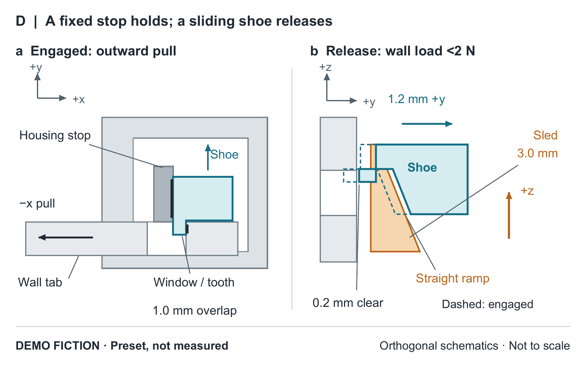

# A housing-stopped sliding shoe for removable bin corners

**DEMO FICTION.** All devices, fixtures and outcomes in this paper are preset constructions for a writing exercise, not physical measurements or simulation results.

**Abstract.** A removable bin corner must retain its wall yet permit release after unloading. Making a snap key harder to bend can raise pullout load while making release difficult. We describe a sliding shoe whose tooth engages the wall tab and whose rear surface bears against a housing stop. An upward-moving ramp retracts the shoe transversely for release. A finite fictional comparison with a simple snap, a cross-pin and a thicker snap exposes the resulting tradeoff. Under the specified dry-grit condition, the shoe configuration releases in 18/20 attempts, versus 14/20, 11/20 and 8/20, respectively. Its 306 N median destructive pullout load remains below the pin and thicker snap, and its hardware is 50% heavier than the simple snap. These constructed outcomes motivate a retention–release compromise, without establishing durability, loaded release or novelty over real connectors.

## 1. Retaining a wall without making release depend on a stiff snap

The object is one upper corner of a small returnable bin: a housing remains fixed to one wall, while a flat tab on the perpendicular wall detaches. The intended sequence is to empty the bin, unload the wall and release the tab. A joint that holds under outward pull is insufficient if its locking member cannot subsequently clear the tab.

The in-project starting configuration A uses the same flexible key for tooth engagement and loaded retention. C makes that key shorter and thicker. B instead uses a removable cross-pin. D changes the relation between holding and release: a guided shoe bears against a fixed stop under outward pull, then slides sideways when a separate sled is raised. The question is whether this arrangement offers a useful combination of retention and completed release under the prescribed contamination, once costs and stronger alternatives remain visible.

The corner receiver, insertion shoulder, chamfered entry and returning catch are inherited choices in this fictional project. The study describes D's geometry and compares complete mechanisms; it does not claim invention of those practices or establish a first-of-its-kind connector.

## 2. Holding contact and transverse disengagement

All alternatives have a nominal 28 × 22 × 18 mm housing envelope, but different internal pockets. The common polypropylene tab is 2.8 mm thick. It enters along +x in the x–z plane; outward separation acts along −x. A, C and D engage an 8 × 6 mm rectangular tab window. B uses a 2.0 mm steel pin through a 2.2 mm hole. Thus equal wall stock does not imply identical tab openings. A common shoulder sets insertion depth at x = 20 mm. Housings and polymer retention components are specified as machined POM stock; B's pin and retaining loop are stainless steel.

In D, the shoe tooth projects 1.0 mm along −y into the window (Figure 1a). The pulling window edge presses the tooth, and a rear shoe surface bears against an x-normal housing stop. The guide permits y translation. An integral return tongue biases the shoe toward engagement; the stop is the specified direct reaction surface for outward pull. No quantitative division of force between tongue and stop is available.

After unloading, raising the separate sled 3.0 mm along +z makes its straight ramp move the shoe 1.2 mm along +y (Figure 1b). The displacement ratio is 0.4, leaving 0.2 mm nominal clearance beyond the 1.0 mm overlap. The stop contact can slide along y during this operation. Return through the integral tongue and ramp interaction is a design intention; return time and frictional efficiency are unknown. The nominal shoe body is 8 × 7 × 5 mm, excluding tooth and tongue, with 2 mm tooth engagement along x. These are geometric inputs, not optimized dimensions or stress predictions.

*Figure 1. DEMO FICTION; preset geometry, not measured. Orthogonal schematic sections of the same D hardware show (a) engagement under −x pull and (b) transverse retraction after unloading below 2 N. Gray denotes the housing, teal the shoe and amber the release sled; the wall tab is outside the hardware part count. The dashed outline in (b) is the engaged shoe position, not another component. Sections are not to scale. The integral return tongue, underside relief slot, insertion shoulder and remaining enclosure are omitted. Arrows show load or motion, not measured force partition.*

A tight precursor pocket, D0, had 0.15 mm nominal side clearance. A deliberately positioned 0.20 mm grain blocked complete release at the 60 N ceiling in an excluded qualitative scratch exercise. D enlarged the clearance to 0.45 mm and added a 1.2 mm wide underside relief slot. The added play has a cost: an adverse-position geometry check leaves 0.7 mm minimum overlap, rather than 1.0 mm nominal. This is a deterministic check, not a measured population minimum. The two simultaneous changes neither isolate a clearance benefit nor establish particle evacuation.

## 3. A finite comparison with distinct retention and release groups

The frozen comparison contains A/B/C/D in clean and grit conditions. Each cell has 20 release fixtures and six separate destructive-pullout fixtures: 208 independent fictional fixtures altogether. Every fixture remains engaged for 300 triangular tensile cycles from 20 to 120 N at 1 Hz. No mechanism fails open in that prescribed sequence. These are load cycles, not 300 detachments.

Grit consists only of dry spherical glass granules, 150–300 µm in diameter. A 0.15 g dose precedes insertion and follows cycles 100 and 200, totaling 0.45 g per fixture without cleaning. Final release follows unloading below 2 N: one attempt at 5 mm/min, limited to 60 N and 10 mm actuator travel. A/C use their release pads, B withdraws its pin and D raises its sled. Full locking-member clearance defines success; no second attempt or shaking is allowed.

The force statistic includes successful attempts only. Separate fixtures receive monotonic −x pullout at 5 mm/min after cycling. Their medians and observed extrema describe destructive retention loss, not working loads. No raw trial traces, inferential statistics or randomized physical testing exist.

## 4. More completed gritty releases, with lower retention and added mass

*Table 1. DEMO FICTION: complete preset comparison after 300 engaged load cycles. Pullout uses six separate fixtures per row; brackets show observed constructed minimum–maximum, not confidence intervals. Release uses one attempt on each of 20 fixtures after unloading below 2 N. †Median peak actuator force among successful releases only; its denominator is the numerator of the adjacent success count.*

| Configuration | Condition | Pullout, N: median [min–max] | Release success | Peak force, N† |
|---|---|---:|---:|---:|
| A | clean | 206 [191–220] | 20/20 | 19 |
| A | grit | 193 [177–208] | 14/20 | 27 |
| B | clean | 382 [361–401] | 20/20 | 7 |
| B | grit | 367 [346–390] | 11/20 | 13 |
| C | clean | 405 [379–428] | 18/20 | 46 |
| C | grit | 391 [362–415] | 8/20 | 54 |
| D | clean | 318 [300–336] | 20/20 | 12 |
| D | grit | 306 [284–328] | 18/20 | 18 |

C has the largest pullout median in both conditions, but only 8/20 gritty releases complete. Its flexible region is 14 mm long and 1.3 mm thick, versus A's 18 mm and 0.9 mm; both retain 1.0 mm nominal overlap. These dimensions motivate the design concern about compliance without establishing strain or damage mechanisms. D gives the most completed gritty releases, but remains below B and C in pullout load. B has the lowest success-only release-force medians in both conditions; its gritty 13 N accompanies only 11/20 successes. Force alone would hide the failed attempts.

D still fails in two gritty releases. Complete mechanisms differ in interfaces and geometry, so their comparison cannot attribute those failures or D's relative success to the stop, ramp, clearance or slot individually. Constructed terminal pullout observations also differ: A's key bends out, B's tab hole elongates, C's window edge tears and D's stop lip fractures. They are coarse prescribed observations, without independent failure analysis or subcritical damage histories.

Complete hardware masses, including housing but excluding tab, are A 8.4 g, B 10.9 g, C 9.2 g and D 12.6 g. A/C have two discrete parts; B/D have three. D therefore adds 50% mass and one part over A, plus another pocket operation and an assembly-alignment step. No monetary cost or assembly duration is available. A's clean 20/20 releases at 19 N also leaves a plausible role for the simpler mechanism when this grit comparison is not the governing concern.

## 5. Scope of the design judgment

The housing-stopped shoe makes the specified holding contact compatible with transverse disengagement after unloading. In this fictional comparison, it exchanges some pullout strength and added hardware for more completed releases in one dry-grit condition. The slot does not establish self-cleaning or sealing, and 18/20 is not contamination immunity or a reliability target. Impact, reverse loading, washing chemicals, temperature, long-term creep, repeated disassembly and release under cargo preload remain outside the exercise. Neither field durability, environmental benefit, production readiness nor novelty against real literature follows from these constructions.
