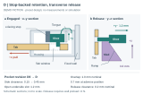

# A Stop-Backed Sliding Shoe for Unloaded Release of a Returnable-Bin Corner

**DEMO FICTION — all designs, fixtures, observations, and numbers are preset constructions. They are neither physical measurements nor simulation results. No real literature or novelty claim is provided.**

## Abstract

A removable bin corner must retain an outward-pulled wall yet permit separation after unloading. This fictional design comparison examines a sliding shoe whose tooth engages a wall-tab window, whose rear surface bears on a fixed housing stop, and whose independent sled retracts the tooth transversely. Four matched-envelope mechanisms are compared using preset clean and glass-grit outcomes. After 300 engaged tensile cycles, the sliding shoe achieves 18/20 gritty releases, against 14/20 for a simple snap, 11/20 for a cross-pin, and 8/20 for a thicker snap. Its gritty destructive pullout median is 306 N, below the pin's 367 N and thicker snap's 391 N. The sliding design also weighs 50% more than the simple snap. These finite constructions illustrate a retention–release tradeoff; they establish neither contamination immunity nor service durability.

## 1. Design question and comparison boundary

At the upper corner of a returnable bin, one wall is permanently fixed to the corner housing and the perpendicular wall ends in a detachable tab. Cleaning motivates removal, but release of a loaded bin is outside the requirement. The intended sequence is to empty the bin, unload the wall, and then unlock its tab.

The engineering question is how the load-bearing contact and the release motion are arranged, and what that arrangement costs. In configuration A, the loaded tooth and flexible key are one piece. C thickens and shortens that key, exposing the cost of seeking greater retention through this change. B provides a mechanically distinct cross-pin control. D introduces a guided shoe and an external release sled. D's proposed advantage is a distinct stop-backed outward-load reaction and transverse unlocking motion; this is a design interpretation, not a measured force partition.

All variants occupy a 28 × 22 × 18 mm housing envelope and use a 2.8 mm polypropylene tab. Their internal pockets and locking openings differ, so they are complete matched-envelope alternatives, not interchangeable inserts in an identical housing. The housing, keys, shoe, and sled are specified as machined POM stock; B's pin and retaining loop are stainless steel. No material properties or molded prototypes are supplied. The receiver, insertion shoulder, lead-in, and returning catch were inherited within this fictional project, not identified as new practices.

## 2. Geometry and operation

The tab enters along +x to a shoulder at x = 20 mm and separates under −x loading. Its plane is x–z; y is the thickness direction and +z points toward the rim. A, C, and D use an 8 × 6 mm rectangular window through the tab. B uses a 2.2 mm hole and a 2.0 mm pin withdrawn along y; its retaining loop prevents loss rather than carrying the specified outward load. A's flexible region is 18 mm long and 0.9 mm thick. C's is 14 mm long and 1.3 mm thick. Both have 1.0 mm nominal tooth overlap. These dimensions motivate a compliance interpretation without establishing strain, fatigue, or damage laws.

In D, the shoe tooth enters the window along −y. The specified 8 × 7 × 5 mm shoe body excludes its tooth and integral return tongue; tooth engagement along x is 2 mm. An outward-pulled window edge presses the tooth toward −x, and the shoe's rear surface bears against an x-facing housing stop (Figure 1a). The guide permits y translation while the stop constrains x motion. The tongue biases engagement; the share of load carried by each feature is unquantified.

After unloading, a 3.0 mm +z sled stroke drives the shoe 1.2 mm along +y through a straight ramp (Figure 1b). Against 1.0 mm nominal overlap, this gives 0.2 mm nominal clearance. The displacement ratio is 0.4, not an efficiency or force ratio. The shoe can slide along the stop face during unloaded release. The tongue–ramp interaction is intended to return the sled, without a separate spring or pivot; return time and friction are unspecified.

An excluded scratch configuration, D0, used 0.15 mm side clearance. A deliberately placed 0.20 mm grain blocked release at the 60 N ceiling. This single qualitative fictional episode motivated two simultaneous revisions: 0.45 mm side clearance and a 1.2 mm open underside slot. More clearance also permits lateral play. A deterministic adverse-position geometry check requires 0.7 mm remaining overlap; it is not a measured population minimum or statistical tolerance analysis. Neither change's separate contribution, particle evacuation, nor the causes of D's remaining failures are known.

**Figure 1. DEMO FICTION; preset geometry.** D separates the stop reaction to outward tab pull (a, x–y section) from ramp-driven transverse retraction after unloading (b, y–z section). The shoe and tongue form one part; the sled is separate. Colors identify housing (gray), tab (ochre), shoe (teal), and sled (violet). The sections show contact and motion schematically, not manufacturing geometry or deformation. Housing envelope: 28 × 22 × 18 mm. Only release at wall preload below 2 N is considered.

## 3. Preset comparison protocol

Eight cells cross A–D with clean and grit conditions. Each contains 20 release fixtures and six different destructive-pullout fixtures, with no reuse across groups or cells: 208 fictional fixtures in total. Every fixture remains engaged through 300 triangular tensile cycles from 20 to 120 N at 1 Hz. These are load cycles, not 300 detachments. No mechanism is prescribed to fail open during that sequence.

Grit consists solely of dry spherical glass granules, 150–300 µm in diameter. Each fixture receives 0.15 g before insertion and after cycles 100 and 200, totaling 0.45 g. Nothing is rinsed or blown out. This narrowly constructed condition does not represent environmental populations.

For final release, wall preload is reduced below 2 N. One actuator attempt at 5 mm/min follows the intended release direction, with a 60 N force ceiling and 10 mm travel limit. A/C are actuated at their release pad, B at its pin, and D at its sled. Success requires full locking-member clearance; there is no retry or shaking. Peak force medians include successful attempts only. Failed-attempt force distributions are unavailable and are not replaced by the ceiling. Separate fixtures undergo monotonic −x pullout at 5 mm/min until retention is lost.

## 4. Constructed outcomes and tradeoffs

**Table 1. DEMO FICTION — preset post-cycle outcomes, not measurements.** Pullout entries are median [minimum–maximum] N across six fixtures per cell. Release counts are successful attempts/20; force medians use only those successful attempts. Mass includes the housing and all retention parts, excluding the wall tab. Conditions follow Section 3.

| Variant | Condition | Pullout, N (n = 6) | Release success | Successful peak force, N | Mass, g / parts |
|:--|:--|--:|:--:|--:|--:|
| A | clean | 206 [191–220] | 20/20 | 19 | 8.4 / 2 |
| A | grit | 193 [177–208] | 14/20 | 27 | 8.4 / 2 |
| B | clean | 382 [361–401] | 20/20 | 7 | 10.9 / 3 |
| B | grit | 367 [346–390] | 11/20 | 13 | 10.9 / 3 |
| C | clean | 405 [379–428] | 18/20 | 46 | 9.2 / 2 |
| C | grit | 391 [362–415] | 8/20 | 54 | 9.2 / 2 |
| D | clean | 318 [300–336] | 20/20 | 12 | 12.6 / 3 |
| D | grit | 306 [284–328] | 18/20 | 18 | 12.6 / 3 |

D has the largest gritty release count, 18/20, but two attempts still fail. B has the lowest success-only release-force median in both conditions: 7 N clean and 13 N gritty, compared with D's 12 and 18 N. In grit, however, B's force median represents only 11 successful attempts. A force-only ranking would omit nine failed B attempts and two failed D attempts. These summaries cannot identify an all-attempt force distribution.

C has the greatest pullout median in both conditions, yet only 18/20 clean and 8/20 gritty releases succeed; its corresponding successful-force medians are 46 and 54 N. Its higher pullout load therefore does not establish better serviceability. D's pullout medians remain below both B and C. Relative to A, D increases the gritty release count from 14/20 to 18/20 and the pullout median from 193 to 306 N, while A already gives 20/20 clean releases at a 19 N successful-force median. D is not preferred by every metric or for every setting.

The prescribed terminal pullout observations are key bend-out for A, tab-hole elongation for B, tab-window tearing for C, and housing-stop-lip fracture for D. They identify coarse terminal events only; no photographs, independent failure analysis, or subcritical damage history support deeper attribution.

D's 12.6 g hardware is 50% heavier than A's 8.4 g, and D has three discrete parts rather than two. It adds a sliding piece, an internal pocket operation, and assembly alignment. The integral tongue is not a fourth part. These burdens remain qualitative except for mass and part count: no assembly time, price, manufacturing yield, or environmental benefit is available.

## 5. Scope of the design lesson

This exercise illustrates a possible separation between outward retention contact and unloaded unlocking motion, with a visible mass and assembly penalty. It does not isolate individual geometric changes: mechanisms differ, B changes the tab opening, and D's pocket revision changes both clearance and opening. The finite preset summaries authorize no confidence intervals, significance tests, reliability target, or real-product novelty claim.

Reverse loads, impact, repeated disassembly, temperature, solvents, long-term creep, and release under cargo preload remain outside scope. The open slot provides no sealing, hygiene, or waterproof qualification. Neither 300 engaged cycles nor 18/20 gritty releases establishes service life or immunity to jamming. A physical validation program would be needed before any operational claim; none is supplied here.
