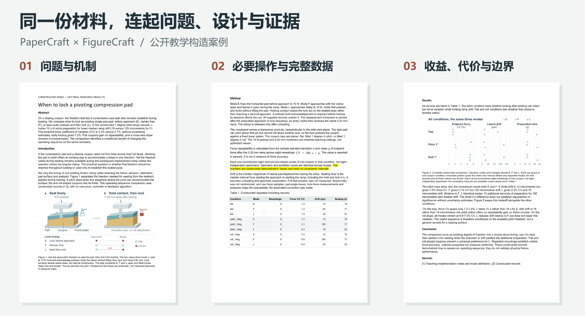
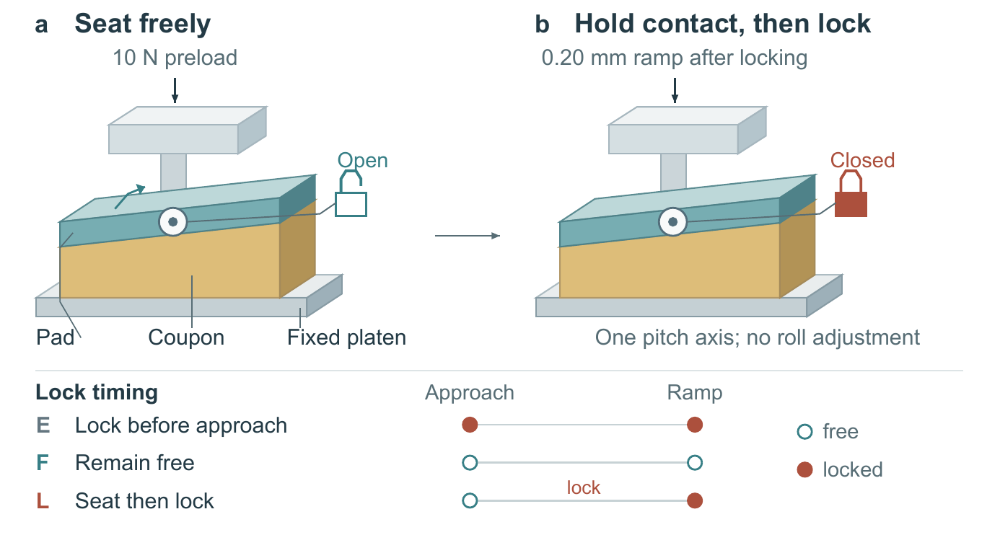

# 同一份材料，连起问题、设计与证据

三个操作模式、九行结果、一套已有夹具。原稿分别介绍零件、操作和数据；完整改稿围绕一个选择往前走：**什么时候需要压头自由转动，什么时候应该锁住？**

**[读三页清稿](selected/clean.pdf)** · [看黄色修改](selected/review.pdf) · [Word 清稿](selected/clean.docx) · [Word 审阅稿](selected/review.docx) · [原始材料](../input/rough.txt)

材料及数值均为公开教学构造，不是真实实验。黄色相对原始 `rough.docx`，原有黄色声明仍保留，不是 Word 原生修订。

[](selected/clean.pdf)

## 先让读者知道为什么比较

原稿从零件和九行结果开始，读者要自己判断它们共同回答什么。改稿先提出具体矛盾：转动有助于贴合斜面，但加载时继续保持自由也可能漂移。因此，比较的对象是已有压头的**锁定时机**，不是一项新转动副。

| 位置 | 原稿的表达重点 | 成稿的表达重点 |
|---|---|---|
| 标题与摘要 | 夹具评估；逐项报告模式和数值 | 何时锁定；把漂移收益与准备时间一起交代 |
| 方法 | 预载、保持、锁定、置零的步骤 | 为什么锁定时不能抬起；为什么需要预载确认和统一增量起点 |
| 结果 | 数据依次出现 | 先解释 E、F、L 的取舍，再用平面和横向坡度判断范围 |

沿可转方向的斜面上，L 相比 F 的漂移为 **19 对 125 μm**，准备时间为 **32 对 17 s**。这不是所有指标一起变好：末端力 CV 为 2.3% 对 2.1%，没有不确定性估计，不能判定等效或显著。

## 让机制图接着论证往前走

旧图依次介绍三种模式，新图以同一夹具的两个状态领读：先贴合，再保持接触锁住。下方短条带保留全部模式的锁定时机。预载确认、置零与卸载条件由方法和图注承接。



[旧机制图](../figure/figure.png) · [新图 SVG](figures/mechanism.svg) · [原尺寸 PDF](figures/mechanism.pdf) · [图注](captions.md)

代价也明确：旧图更直接显示 E 的初始边缘接触，新图把这项比较放在模式条带、方法文字和旧图对照中；没有用新视图声称观察到接触压力分布。结构仅为示意，斜度放大，只有一个转动轴。

## 让完整结果检验这个选择


结果图由同一 CSV 生成，保留全部 **27 个指标值**。沿行比较平面、可转方向斜面和不可转方向斜面，沿列比较力变异、漂移和准备时间；完整数值表仍在正文里。平面没有重复性收益，横向斜面的高变异也没有被解决。

[原始九行数据](../input/results.csv) · [结果 SVG](figures/results.svg) · [原尺寸 PDF](figures/results.pdf)

## 拿到完整文件

第一页面向研究问题和动作；第二页保留必要操作、指标定义、原生公式和完整表格；第三页把收益、代价和边界放在一起。两图均以 160 mm 宽嵌入，SVG 和 PNG 表示来自同一生成结果。

[清稿 PDF](selected/clean.pdf) · [黄色稿 PDF](selected/review.pdf) · [前一版清稿 PDF](../clean.pdf) · [原稿 Word](../input/rough.docx)

## 重建

从 PaperCraft 仓库根目录运行，输出目录必须尚不存在：

```sh
python examples/clamp-timing/complete/build_delivery.py --out rebuilt-story --figures examples/clamp-timing/complete/figures
```

需要 `python-docx`、`lxml`。此命令应用已写好的补丁并组装 Word，不调用模型。导出 PDF、页面图使用仓库已有渲染入口，需要 LibreOffice 与 Poppler：

```sh
python scripts/render_review.py rebuilt-story/clean.docx render-clean --soffice SOFFICE --pdftoppm PDFTOPPM
python scripts/render_review.py rebuilt-story/review.docx render-review --soffice SOFFICE --pdftoppm PDFTOPPM
python examples/clamp-timing/complete/verify.py --delivery rebuilt-story --figures examples/clamp-timing/complete/figures --out checks.json
```

`SOFFICE`、`PDFTOPPM` 替换为实际可执行文件路径。PDF 在对应渲染目录；若需检查 PDF 页数和页内容，将 PDF 复制到 `rebuilt-story/` 后再运行核对。没有 PDF 时，核对脚本只执行 Word 与图源检查，不代表视觉验收。

两图的独立生成源与材料放在 [FigureCraft 联合案例](https://github.com/zlsjtj/FigureCraft/tree/main/examples/lock-timing-story)。它可独立重建 SVG/PDF/PNG；本目录保存完全相同的成图，文稿组装不依赖另一个仓库在线可用。

[本轮内容核对](verification.json) · [改动与阅读取舍](review.md) · [此前独立模型比较](../comparison/model-review.md)
