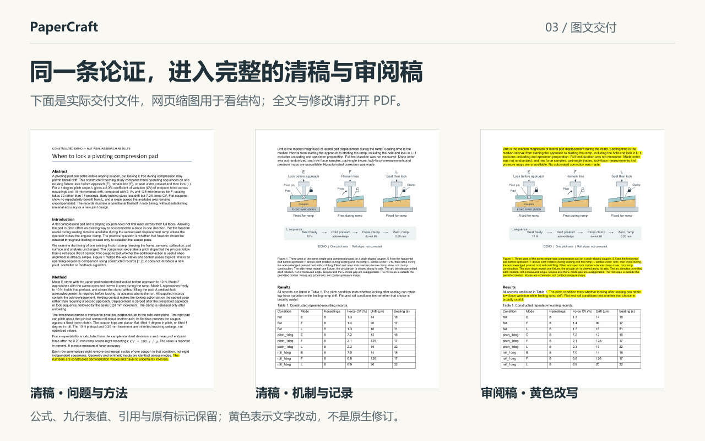
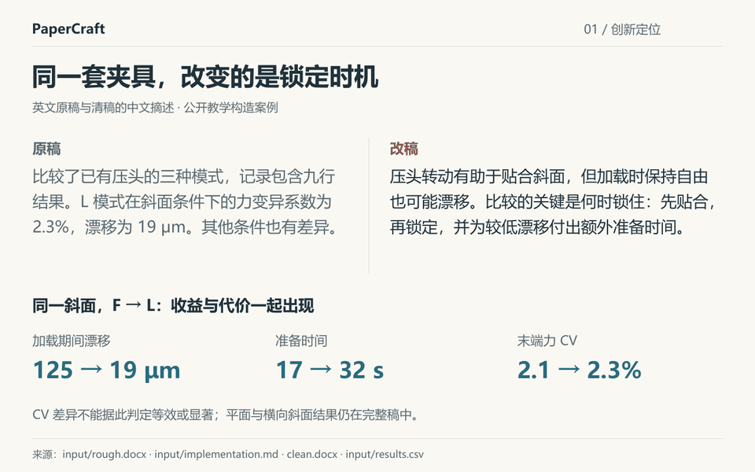

# 从操作记录到论文论证

同一份材料，依次看创新定位、必要技术工作和完整交付。下面是英文原稿与清稿的中文摘述，所有数值均为教学构造。

## 1. 先讲清研究选择


改变的是**已有压头的锁定时机**。自由转动有助于就位，加载时保持自由又可能漂移。改稿先提出这个矛盾，再比较相同斜面下的模式：漂移降低，准备时间增加；没有把已有转动副写成新发明。

## 2. 把操作写成必要的决定


预载确认决定何时允许锁定；不抬起压头，是为了保留已就位姿态；锁后置零统一加载增量的起点。这些理由来自实现说明。缺确认时终止是既有逻辑，记录中没有缺确认的情况，不能由此声称做过故障恢复试验。

## 3. 看完整文件，而不只看一段摘要



**[打开清稿 PDF](../clean.pdf)** · [黄色审阅 PDF](../review.pdf) · [Word 清稿](../clean.docx) · [Word 审阅稿](../review.docx) · [原稿](../input/rough.docx)

正文继续交代九行记录、指标定义、单个试件的八次重新就位，以及平面和另一倾斜方向的结果。黄色表示文字改写，不是 Word 原生修订；原有黄色声明保留。

<details>
<summary>30 秒看完这份案例</summary>



这是对实际文件制作的三页导览，不是实时生成录像。

</details>

## 修改展示图或重建

展示图由 [Python 源码](build_showcase.py)生成；[SVG](assets/contribution.svg)中的文字与线条可编辑，实际论文页面作为图片嵌入。公开页面图在 `pages/`，对应本例清稿与审阅稿的三页渲染。

在本仓库根目录运行，替换字体及 Poppler 路径：

```powershell
python examples/clamp-timing/showcase/build_showcase.py --case examples/clamp-timing --clean-pages examples/clamp-timing/showcase/pages/clean --review-pages examples/clamp-timing/showcase/pages/review --out showcase-rebuilt --font C:/Windows/Fonts/msyh.ttc --bold-font C:/Windows/Fonts/msyhbd.ttc --pdftoppm <pdftoppm完整路径>
```

需要 Pillow、ReportLab、python-docx 和 Poppler。其他系统可传入覆盖中文的 TrueType 字体，重新检查换行。输出目录必须尚不存在。

本轮将已有修订整理成可读的展示，没有重新改写论文。[完整输入、改稿生成与首评记录](../README.md) · [本轮核对记录](validation.json)。固定脚本重建与技能从新材料生成是两项不同的验证。
