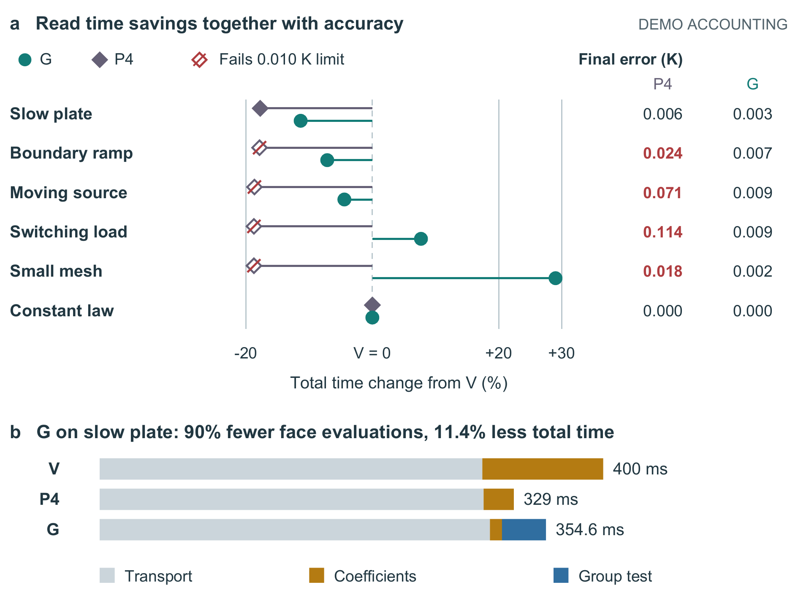

# 热传输全文：先让困难可见，再讨论收益

本例随PaperCraft 2.22.0维护。全部材料和数值都是 **DEMO FICTION / DEMO_STIPULATED**，没有求解器运行、真实实验或文献新颖性证明。它是已见材料的开发案例，不算独立迁移验证。

直接看[清稿PDF](documents/manuscript.pdf)、[黄色审阅稿](documents/review.docx)和[2.21完整前版](revisions/2.21-complete/documents/manuscript.pdf)。黄色相对`revision-base.md`，不是原生修订。当前两图按160 mm宽入稿，六个原生公式、两表和所有负结果保留。

## 实际选择

| 候选 | 得到与失去 |
|---|---|
| 以结果进入：先比较固定计划与自适应成本 | 有用范围明确，但读者在理解一次更新之前就要比较V/P4/G。保留候选，未选。 |
| 以失败操作进入：旧系数不能用被邻组改写的快照判断 | 先建立因果认识，再解释所有权决定和代价。选用；代价是增加了一个必要情境，不是字数全面减少。 |
| 主图用单条缓存记录及三条对应线 | 端点映射直接，但长线跨越多个区域。未选。 |
| 主图用同一记录的前后状态 | A保留r与B推进s可直接对照。选用；端点到快照主要靠符号对应，图注明确两列不是两份分配。 |

首稿及两种入口见[本轮开发记录](revisions/2.22/)。[匿名首读](revisions/2.22/anonymous-first-look.md)先于全文核查；K为前版，L为首选稿。模型倾向L的因果认识和状态解释，但认为K标题领域信息与紧凑性更好。随后恢复标题领域信息，把Discussion中的场景复述改成比较合格方案的判断。首评不倒写为最终稿获胜，没有真人参与。




图2保持原编码和文件，不算本轮新收益。它把时间与精度放在同一行，保留失败和负收益，并用完整成本解释局部工作减少不等于总体加速。两图任务不同，不套同一模板。

## 重建

`input/`保存原始材料和CSV；`manuscript.md`为当前全文；`figures.json`绑定图注；`build_snapshot.py`为FigureCraft的snapshot-state生成器固定副本。`build_document.py`只支持本例限定Markdown，不代替保护复杂Word的主工具。

```powershell
python -m pip install -r examples/heat-story/requirements.txt
python examples/heat-story/build_example.py --out heat-story-output --figure-font C:/Windows/Fonts/arial.ttf --figure-bold C:/Windows/Fonts/arialbd.ttf --table-font C:/Windows/Fonts/times.ttf --table-bold C:/Windows/Fonts/timesbd.ttf --pdftoppm <pdftoppm.exe的完整路径>
```

输出目录必须不存在。先从源码与CSV生成两图，再构建清稿、黄稿与较早原始基线。依赖为本目录requirements、字体和Poppler。Word转PDF与逐页图使用宿主documents技能的`render_docx.py --emit_pdf`及LibreOffice；这些外部工具不捆绑。固定源码重建不是新材料自主生成测试。

## 尚未解决

主图的状态对照较直接，但网格与记录之间仍需符号核对，尚不能宣称顶刊审美。公式保持原有线性记号；数据表较密并跨页；黄色以段落为粒度，删除和移动看开发记录。这些属于实际页面的限制，不能用数学XML相同消除。生成者完成主图后发生服务容量错误，维护者完成整合与核查，不隐瞒接续。

完整本轮结果见[验收记录](../../tests/validation-2.22.md)，技术、模型评阅与作者认可分别记录。原始用户论文、视频和参考截图不在本例中。

发布文本统一LF换行；历史构建收据保留当时原始字节标识，当前包另有安装哈希。热稿图2 PDF含生成时间，重建比较其绘制流、文字、SVG及PNG；不要求带时间元信息的PDF字节相同。
