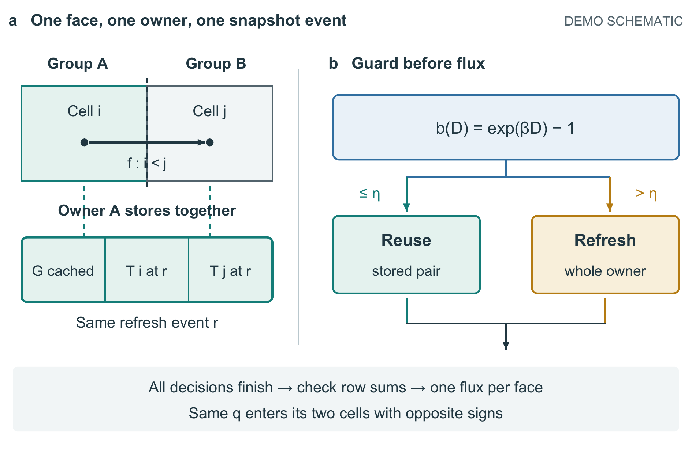
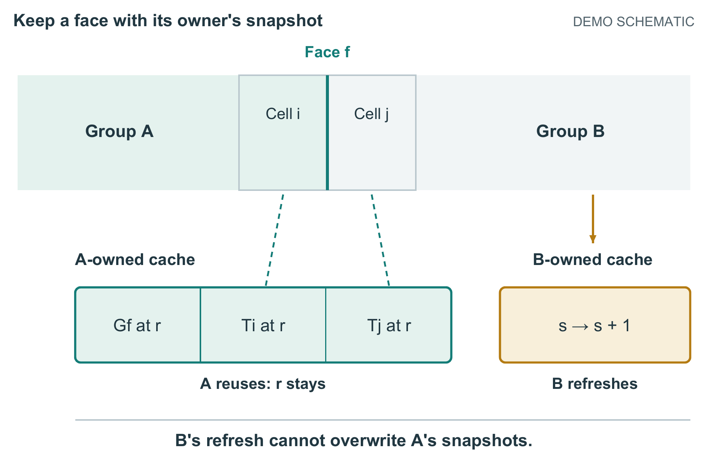

# 热传输图文组：从技术困难到完整代价

本例随 PaperCraft 2.21.0 归档，包含此前积累的图文开发与本轮全文修订。全部研究内容和数值都是 **DEMO FICTION / DEMO_STIPULATED**；没有求解器执行、真实实验或新颖性证明。材料在此前开发中使用过，本次不算未见材料验证。

直接看[清稿 PDF](documents/manuscript.pdf)、[黄色审阅稿](documents/review.docx)和[本轮前版 PDF](../2.20/documents/manuscript.pdf)。本轮前后均为7页，两张图仍按160 mm宽入稿，6个原生公式的内容与XML、两表逐单元格相同。[更早的无图基线](documents/baseline.pdf)为6页，不能用它冒充本轮前版。黄标相对 `revision-base.md`，不是原生修订。

本轮把指数测试、快照读取与额外内存放回设计取舍，把结果组织为哪些场景应选G/P4/V。匿名模型比较倾向新版的价值表达，但认为旧版快照错配的铺垫更容易跟随；长表与线性公式仍是负担。首稿、一次自审稿及[得失记录](../2.21/edit_notes_zh.md)均保留。[审阅原记录](../2.21/anonymous-review.md)中K为新版、L为前版；首次读取超出前部范围，不能宣称严格初读盲测。下面的图形选择过程属于此前开发，两图本轮保留，不计作本轮新收益。

## 为什么这样改

原稿已经交代了方法与限制，但读者要到方法节才明白跨组快照为何难以保持一致；结果首先给出完整记录，读者需自己配对时间、误差与代价。修改没有增加创新条数：引言先用跨组边界面解释困难，再归属已有的连续循环与通量复用，最后提出“省下的计算是否抵得过判断成本”。重要继承关系与两项耗时负结果曾在压缩中变弱，评阅后已恢复。

| 方案 | 得到什么 | 失去什么、为何选或弃 |
|---|---|---|
| 首个机制候选：所有权小图加大面积步骤流程 | 执行顺序齐全 | 常规检查比快照一致性更抢眼；保留为对照，未选用。 |
| 最终机制图：同一边界面的两个端点与各自缓存状态 | A保留r、B更新s的关系成为主体，跨组端点与A拥有的快照直接相连 | 不再逐框解释所有执行步骤；这些条件仍在正文3.2节。模型反馈后才修好单元归属的连续底色，不能算无反馈首稿成功。 |
| 结果图：时间变化旁同时列误差，下面展开一个完整成本 | 更快却不合格的P4不会被误读为全面胜者；90%局部工作减少与11.35%总时间减少可直接对照 | 仍有六行必要数值，图2图注较长；完整18行记录和6行扫描留在正文两表，没有删掉负结果。 |

首个候选与最终图都用160 mm宽；没有放大最终图制造优势。这里是逻辑所有权与定量关系，透视不会帮助判断，所以采用二维。空间对象应另选适合其结构的造型，本例不提供通用框图模板。






## 输入与重建

- `input/`：未整理原稿、实现说明、来源边界，以及两份原始CSV。
- `revision-base.md`、`manuscript.md`：本轮基线和修订全文；`baseline.md`保留更早原稿。`figures.json`按完整图注绑定入稿资源。
- `build_figures.py`：最终图的可编辑绘制源码；`figures/*.svg`保留独立矢量对象，PDF嵌入字体。
- `first/build_figures_first.py`：首次候选源码，不是事后模拟出来的“旧版”。
- `build_document.py`：本演示的限定Markdown到Word排版器，不是任意复杂Word替换工具；未知块会拒绝。保护既有复杂稿件仍用主技能的格式感知路径。

从仓库根目录运行，字体和Poppler使用本机真实路径：

```powershell
python -m pip install -r examples/heat-story/requirements.txt
python examples/heat-story/build_example.py --out heat-story-output --figure-font C:/Windows/Fonts/arial.ttf --figure-bold C:/Windows/Fonts/arialbd.ttf --table-font C:/Windows/Fonts/times.ttf --table-bold C:/Windows/Fonts/timesbd.ttf --pdftoppm <pdftoppm.exe的完整路径>
```

输出目录必须不存在。命令实际从CSV重画两图，再构建清稿与黄稿；不会覆盖旧输出。外部依赖为Python、ReportLab、Pillow、NumPy、pypdf、python-docx和Poppler，见本目录`requirements.txt`。换字体需重新看页面，不能假定排版相同。

Word转PDF使用宿主documents技能的真实`render_docx.py`，并按其依赖说明安装LibreOffice和Poppler；分别为两份Word指定新输出目录，传入`--emit_pdf`。本仓库不捆绑这些外部程序，也不把固定图源重建当作模型能自主生成新图的证据。

## 这次能说明什么

执行者在新上下文中读原始材料、候选技能和依赖后绘图；父任务选方案、补图文衔接并根据匿名身份的模型评阅修复。首评看A/B文稿与原始事实，不看修改理由；没有随机采样、普通提示组或真人。最终复验是知情的反馈后复验。完整示例在作品完成后写入技能，尚未再由另一执行者只读此示例验证迁移。

本次支持的结论是：这个开发材料中，技术困难更早可见，机制与证据形成了连续阅读路径，图文实际进入Word/PDF。它不证明稳定达到顶刊插图质量、审稿人会接受、一次生成即可完成或其他论文同样改善。

最终仍有线性公式记号、公式组跨页、数据表较密和整段黄标粒度较粗的问题；完整细节仍带来阅读负担。六式XML与两表逐单元格核对相同，不能据此说公式排印已精修。基线历史PDF曾显示异常分隔符，但同一基线DOCX重新渲染后正常，已从技能改进收益中排除。详见[本地验证记录](../../../../tests/local-story-validation.md)。
