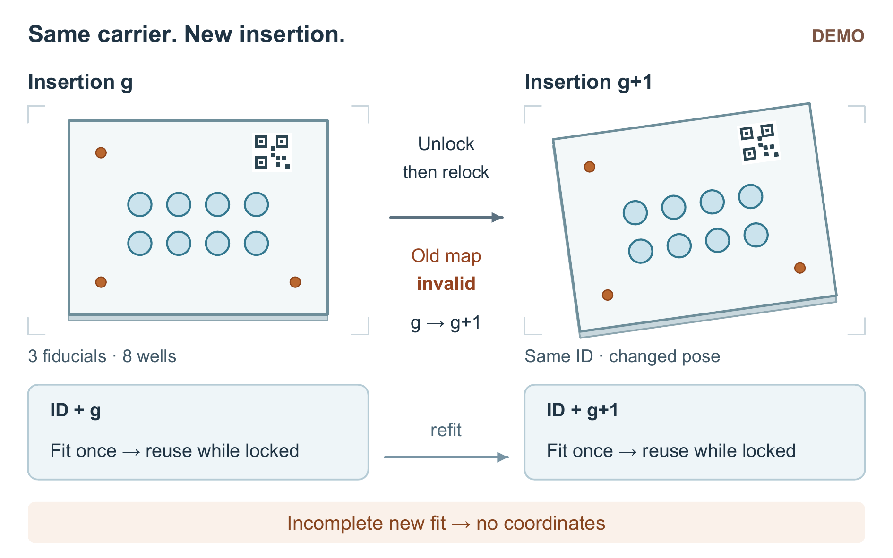

# Reusing an Image-to-Carrier Map Until Reinsertion: A Demonstration

*DEMO: this manuscript uses constructed data and a deterministic replay, not physical experiments or measured device performance.*

## Abstract

A removable imaging carrier can retain its identity while changing its pose. Saving its image-to-carrier mapping by identifier alone therefore risks reporting coordinates from an earlier insertion. This demonstration ties reuse to both carrier identity and an insertion generation derived from lock events. Across 80 constructed frames containing eight insertions, generation-aware reuse takes 6.20 s with a median error of 0.024 mm, compared with 25.60 s and 0.023 mm for refitting every frame. Reuse loses its time advantage when each insertion supplies only one frame. The example illustrates when a saved mapping remains usable; it introduces neither a new affine solver nor demonstrated hardware performance.

## 1. Introduction

Repeated images of a locked carrier can use the same coordinate mapping, but removing and reinserting that carrier changes the question. A readable identifier confirms which carrier is present; it does not establish where the carrier now lies in the image. Reusing a mapping under the wrong condition can thus produce coordinates quickly while retaining the wrong spatial reference.

We compare three programs to separate this validity decision from the familiar three-point affine fit. V1 retains the first mapping and subsequently checks only identity. V2 fits a mapping in every frame. V3 retains a mapping only for the current identity and insertion generation. The central comparison asks whether this intermediate policy preserves the low coordinate errors of repeated fitting while reducing total processing time, including its checks.

## 2. Method: give the saved mapping an insertion lifetime

Each 40 × 30 mm carrier has three circular fiducials at (0,0), (30,0), and (0,20) mm and eight circular specimen wells on a four-by-two grid. Fiducials and wells have radii of 0.8 and 1.8 mm, respectively. Well centers use x = 6, 12, 18, 24 mm and y = 6, 12 mm. Three detected fiducials define one affine map from image coordinates (u,v), in pixels, to carrier coordinates (x,y), in millimetres; that single map serves all eight wells in the frame.

For example, image fiducials (40,20), (640,20), and (40,420) give x = 0.05u − 2 and y = 0.05v − 1. The image point (280,140) consequently maps to (12,6) mm. Reinsertion requires a new fit, not a change to this solving method.

V3 makes the lifetime explicit (Figure 1). Unlocking immediately invalidates the saved map; reclosing the lock increments the generation. The first frame with a new identity–generation pair must provide all three fiducials before V3 saves one current map. Subsequent frames reuse it while the lock remains closed and the pair is unchanged. An identity or generation change requires refitting. A missing fiducial during that initial fit causes rejection rather than reuse of an earlier map. Unreadable identity or unknown lock state also prevents output on subsequent frames. The contact reports lock events, not pose.

**Figure 1. DEMO — one carrier, two successive insertion states.** The repeated carrier has the same identity and the same three small fiducials and eight larger wells. Its changed image pose after reinsertion is schematic; no second transform or measured displacement is implied. Opening the lock invalidates the saved map, and reclosing advances generation g to g+1. V3 fits once for each identity–generation pair and reuses that map only while the pair and closed lock persist; the two map boxes show successive states, not two simultaneously valid maps. All three fiducials are needed before a new map can produce coordinates. Front-face geometry follows the supplied carrier dimensions; the shallow rim and ID symbol only aid recognition.

## 3. Results and discussion

Table 1 retains every constructed record. Each group is one deterministic replay, without repeated-trial variance or confidence intervals. Error is the median two-dimensional Euclidean error over the eight known well centers across the group's frames. Total time includes image reading, fiducial localization, fitting, identity/generation checks, and coordinate output; exposure waiting is excluded. Detection and postprocessing implementations are fixed. Different group lengths prevent direct cross-group speed comparisons.

The reinsertion sequence B gives the decisive comparison. Over eight insertions of ten frames each, V3 is 4.13 times as fast as V2 by total-time ratio, with median errors of 0.024 versus 0.023 mm. V1 finishes in 3.50 s but has a 0.405 mm error. D repeats B's event sequence with V3's generation check disabled and identity checks retained, yielding the same 0.405 mm error. This failure control exposes the inadequacy of identity alone; it is not another proposed final algorithm.

The benefit depends on frames available for reuse. In locked sequence A, all three errors are similar, while V1 is faster than V3. In C, eight single-frame insertions leave no later frames to reuse: V3 takes 2.75 s versus V2's 2.56 s, 7.4% longer, with equal 0.023 mm errors. These are whole-program comparisons, not isolated measurements of fitting savings.

With one fiducial missing from each new insertion's first frame, both V2 and V3 reject all eight frames in E. V1 emits all eight; no error values are supplied. Rejection therefore describes withheld output, not identification success or a measured coordinate error.

*Table 1. Complete DEMO records. Time is per group; “—” means no error value was supplied.*

| Scenario | Frames | Insertions | Program | Time (s) | Error (mm) | Output | Rejected |
|---|---:|---:|---|---:|---:|---:|---:|
| A | 80 | 1 | V1 | 3.50 | 0.022 | 80 | 0 |
| A | 80 | 1 | V2 | 25.60 | 0.021 | 80 | 0 |
| A | 80 | 1 | V3 | 4.30 | 0.022 | 80 | 0 |
| B | 80 | 8 | V1 | 3.50 | 0.405 | 80 | 0 |
| B | 80 | 8 | V2 | 25.60 | 0.023 | 80 | 0 |
| B | 80 | 8 | V3 | 6.20 | 0.024 | 80 | 0 |
| C | 8 | 8 | V1 | 0.35 | 0.403 | 8 | 0 |
| C | 8 | 8 | V2 | 2.56 | 0.023 | 8 | 0 |
| C | 8 | 8 | V3 | 2.75 | 0.023 | 8 | 0 |
| D | 80 | 8 | V3_no_generation | 4.10 | 0.405 | 80 | 0 |
| E | 8 | 8 | V1 | 0.35 | — | 8 | 0 |
| E | 8 | 8 | V2 | 2.40 | — | 0 | 8 |
| E | 8 | 8 | V3 | 2.58 | — | 0 | 8 |

## 4. Conclusion and limits

Insertion-bounded reuse offers a useful time–error tradeoff in the constructed multi-frame sequences, but no time benefit in the single-frame case. Its validity assumes a stable pose while locked: microslip is not checked. Missed unlock events were not simulated, so stale mappings are not universally excluded. Carrier bending, lens distortion, subpixel fitting, and collinear fiducials are outside this demonstration. The next real evaluation must test these conditions before the illustrated policy can support device-level claims.
