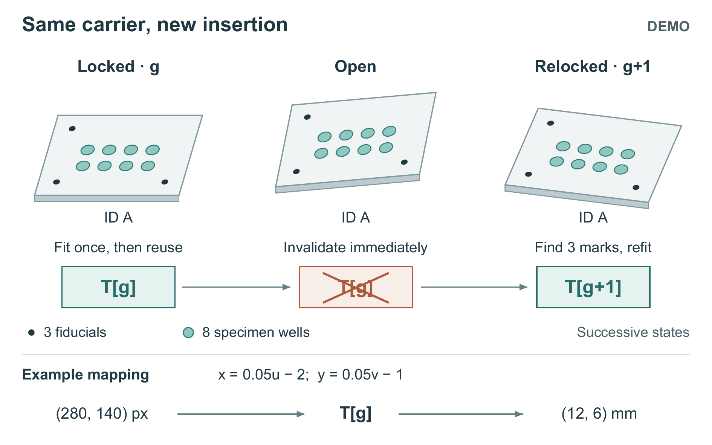

# Reusing an Imaging Transform Only Within One Carrier Insertion

**DEMO — All values are hand-set demonstration inputs. No physical experiment was performed.**

## Abstract

A removable imaging carrier can return with the same identifier but a different pose. Reusing its previous image-to-carrier transform can then produce incorrect coordinates. This demonstration binds a retained transform to both the carrier identifier and an insertion generation. Unlocking invalidates the transform; relocking requires a new fit. Across eight insertions with ten frames each, this design takes 6.20 s with 0.024 mm median error, compared with 25.60 s and 0.023 mm for per-frame fitting. However, with one frame per insertion it is slightly slower. These constructed values illustrate a conditional reuse decision, not measured device performance or a new affine solver.

## Introduction

The useful lifetime of a calibration depends on the placement it describes. A code on a carrier identifies the object, but does not establish that the object occupies its previous pose. This distinction matters when an imaging workflow removes and reinserts the same carrier: a stored transform can remain associated with the correct identifier while describing an obsolete placement.

Fitting every frame already avoids that particular reuse problem. The remaining question is whether a program can retain a transform during an unchanged insertion without carrying it into the next one. We compare identifier-only retention (V1), per-frame fitting (V2), and retention bounded by insertion generation (V3). Figure 1 follows the event that separates V3 from V1. The comparison includes both opportunities for repeated use and cases in which its additional checks do not recover their cost.

## Method

The 40 × 30 mm carrier contains three circular fiducials and eight circular specimen wells. Fiducial centers are (0,0), (30,0), and (0,20) mm. Well centers combine x = 6, 12, 18, 24 mm with y = 6, 12 mm. Their radii are 0.8 and 1.8 mm, respectively; the carrier extends from −5 to 35 mm in x and −5 to 25 mm in y. Fiducials determine the affine mapping; wells are its coordinate targets.

V2 locates all three fiducials and fits once per frame, using that mapping for all eight wells. V1 fits on first recognition and thereafter checks only the identifier. V3 instead retains one valid mapping for the current identifier–generation pair. It checks the pair each frame and refits whenever either component changes. An unlock event immediately invalidates the saved mapping; relocking increments the generation. The mechanical contact reports open or closed, not a precise pose. With continuous closure and an unchanged identifier, subsequent frames reuse the mapping.

On a new insertion, V3 rejects the frame if a fiducial is missing rather than using the previous generation's matrix. An unreadable identifier or unknown lock state also prevents output. For the supplied example, image fiducials (40,20), (640,20), and (40,420) pixels yield x = 0.05u − 2 and y = 0.05v − 1 in millimetres. Thus (280,140) pixels maps to the well at (12,6) mm. Reinsertion requires another fit; its matrix is unspecified.

Figure 1. DEMO: the same carrier and its saved mapping through successive insertion states. Filled black circles are the three fiducials; larger teal circles are the eight specimen wells. During generation g, one fit supplies all wells and subsequent frames reuse it while the lock stays closed and the identifier is unchanged. Opening invalidates that map. Relocking advances the generation, so the unchanged ID A cannot authorize reuse: all three fiducials must support a new fit. A missing fiducial causes rejection. The views are sequential, not three carriers or simultaneously valid maps. Carrier geometry follows the specified coordinates; the slight depth and poses are illustrative, with no thickness or displacement scale. The lower example is the supplied first-insertion mapping. Timing and failure controls remain in Table 1.

## Results and discussion

Table 1 preserves every supplied record. Each group is one deterministic demonstration replay, without repeated-trial variance or confidence intervals. Error is the median two-dimensional Euclidean error over eight well centers per frame against known centers. Total processing time includes image reading, localization, fitting, checks, and output, but excludes exposure waiting. Detection and post-processing implementations are fixed; fewer fits are not themselves a timing measurement. Group lengths differ, so comparisons below pair variants within a scenario.

In the locked 80-frame case A, V1 is already sufficient: its 0.022 mm error matches V3, while taking 3.50 rather than 4.30 s. In case B, eight reinsertion intervals of ten frames expose identifier-only reuse: V1's error is 0.405 mm. V3 stays near V2's error (0.024 versus 0.023 mm) with lower total time (6.20 versus 25.60 s). This supports the whole program's conditional tradeoff, without assigning the gain to an isolated operation.

Case C removes reuse opportunities: with one frame per insertion, V3 takes 2.75 s versus V2's 2.56 s at the same 0.023 mm error. Disabling generation checks in V3 for case B's event sequence gives 0.405 mm error in D despite retaining identifier checks. This failure control is not another final algorithm. In E, every new insertion lacks one fiducial: V2 and V3 reject all eight frames, whereas V1 outputs all eight. No coordinate errors are supplied for E; rejection counts do not measure recognition success.

**Table 1. Complete constructed DEMO records.** Error is median Euclidean well-center error. “—” denotes an unreported error, not zero. F and I are frame and insertion counts.

| Scenario | F | I | Variant | Time (s) | Error (mm) | Output | Rejected |
|---|---:|---:|---|---:|---:|---:|---:|
| A_locked | 80 | 1 | V1 | 3.50 | 0.022 | 80 | 0 |
| A_locked | 80 | 1 | V2 | 25.60 | 0.021 | 80 | 0 |
| A_locked | 80 | 1 | V3 | 4.30 | 0.022 | 80 | 0 |
| B_reinserted | 80 | 8 | V1 | 3.50 | 0.405 | 80 | 0 |
| B_reinserted | 80 | 8 | V2 | 25.60 | 0.023 | 80 | 0 |
| B_reinserted | 80 | 8 | V3 | 6.20 | 0.024 | 80 | 0 |
| C_one_frame | 8 | 8 | V1 | 0.35 | 0.403 | 8 | 0 |
| C_one_frame | 8 | 8 | V2 | 2.56 | 0.023 | 8 | 0 |
| C_one_frame | 8 | 8 | V3 | 2.75 | 0.023 | 8 | 0 |
| D_no_generation | 80 | 8 | V3_no_generation | 4.10 | 0.405 | 80 | 0 |
| E_missing_mark | 8 | 8 | V1 | 0.35 | — | 8 | 0 |
| E_missing_mark | 8 | 8 | V2 | 2.40 | — | 0 | 8 |
| E_missing_mark | 8 | 8 | V3 | 2.58 | — | 0 | 8 |

## Conclusion

The demonstration makes transform reuse conditional on a continuing insertion, with useful time savings only in the reported repeated-frame cases. It assumes stability while locked and does not detect microslip. Missed unlock events were not simulated, so all stale mappings have not been excluded. Carrier bending, lens distortion, subpixel fitting, and collinear fiducials are outside scope. Affine fitting and code recognition remain established tools; this exercise establishes neither solver novelty nor hardware performance.
