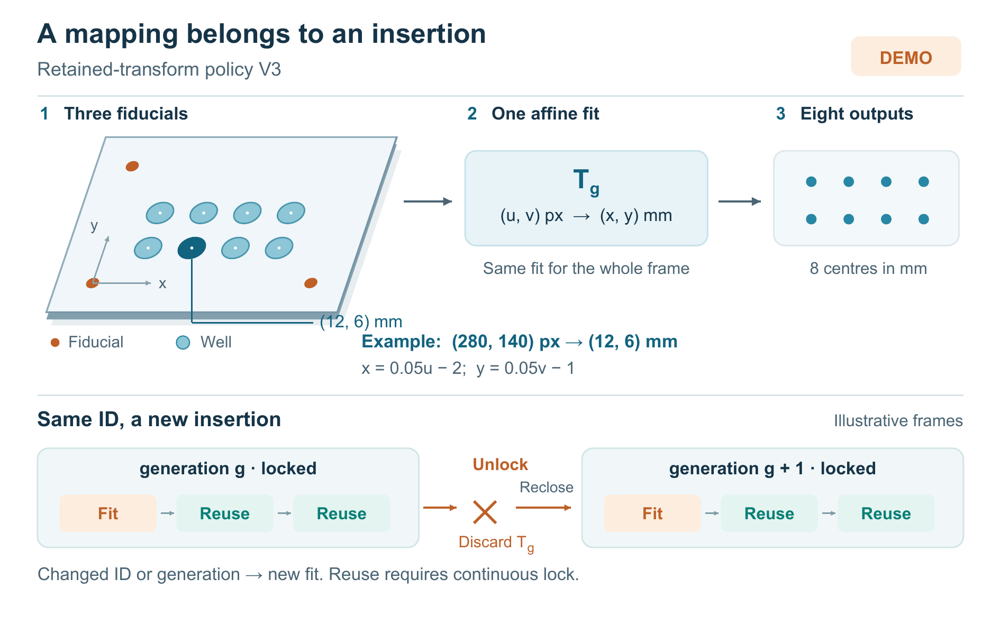

# DEMO: Insertion-scoped coordinate mapping for a removable imaging carrier

## Abstract

Reusing a coordinate transform can reduce processing time, but identifying a removable carrier does not establish that its pose is unchanged. This demonstration compares three mapping policies for an imaging carrier with three fiducials and eight specimen wells. The retained-transform policy, V3, associates its single saved mapping with both carrier identity and insertion generation. In a prescribed 80-frame reinsertion sequence, V3 takes 6.20 s with 0.024 mm median coordinate error, versus 25.60 s and 0.023 mm for per-frame fitting. Its advantage disappears when each insertion supplies only one frame. These hand-set demonstration data illustrate a conditional reuse policy, not measured device performance or a new affine solver.

## Introduction

A removable carrier creates two different questions: which carrier is present, and whether a previously fitted mapping still describes its current insertion. A code answers the first question. Reusing that answer for the second can silently preserve an obsolete mapping after the same carrier is removed and returned. Conversely, fitting every frame repeats work even while the carrier remains locked in place. The design question in this demonstration is therefore when a mapping may be retained and when it must be replaced. Figure 1 connects the carrier geometry to this mapping lifetime.

## Methods

The 40 × 30 mm carrier contains three circular fiducials at (0, 0), (30, 0), and (0, 20) mm, plus eight circular wells at x = 6, 12, 18, or 24 mm and y = 6 or 12 mm. Fiducial and well radii are 0.8 and 1.8 mm, respectively. Three corresponding image points determine a two-dimensional affine mapping from pixels (u, v) to millimetres (x, y). One fit serves all eight wells in a frame. For the supplied example, x = 0.05u − 2 and y = 0.05v − 1, mapping (280, 140) pixels to (12, 6) mm.

V1 saves the first mapping and thereafter checks only carrier ID. V2 locates all three fiducials and refits every frame. V3 saves one mapping keyed by ID and insertion generation. Unlocking immediately invalidates it; reclosing increments the generation. A changed ID or generation requires a new fit. Subsequent frames reuse the mapping while the key is unchanged and the lock remains closed. The mechanical contact reports lock events, not pose. An incomplete initial fit, unreadable ID, or unknown lock state prevents V3 from outputting coordinates.

Each scenario is one deterministic demonstration replay. Timing covers image reading, localization, fitting, checks, and coordinate output, excluding exposure waiting. Error is the median two-dimensional Euclidean error across the eight known well centres in each frame. No replicate variability or confidence interval is available.

## Results and discussion

Table 1 retains every supplied result. In A, all 80 frames follow one insertion. V1, V2, and V3 have similar median errors of 0.022, 0.021, and 0.022 mm. V3 takes 4.30 s versus V2's 25.60 s, although V1 is faster at 3.50 s. In B, eight insertions each supply ten frames. V3 retains a low median error of 0.024 mm, close to V2's 0.023 mm, while taking 6.20 rather than 25.60 s. V1 remains fast but its error rises to 0.405 mm: matching identity alone is insufficient for this event sequence.

C provides the necessary counterexample to a general speed claim. With one frame per insertion, V3 takes 2.75 s versus V2's 2.56 s, and both have 0.023 mm error. Reuse has no subsequent frame to serve. D disables only V3's generation check for B's event sequence. Its 4.10 s time accompanies 0.405 mm error, exposing the failure of retaining a mapping on identity alone.

In E, every new insertion's first frame lacks one fiducial. V2 and V3 reject all eight frames; V1 still outputs all eight. No coordinate errors are supplied for E, so those outputs cannot be called correct. Rejection counts describe withheld coordinates, not recognition success. Scenario lengths differ, so cross-scenario total times do not establish relative processing speed; fitting counts alone also do not measure time savings.

The policy assumes positional stability while locked and does not check for microslip. Missed unlock events were not simulated, so generation checking does not eliminate every stale-mapping risk. Carrier bending, lens distortion, subpixel fitting, and collinear fiducials are outside the demonstration. Affine fitting and code recognition are established components, and the solver is unchanged by reuse.

## Conclusion

This demonstration makes mapping lifetime explicit: retain a transform within a stable insertion and replace it when its key changes. The prescribed results show the tradeoff among processing time, coordinate validity, and withheld output. Physical validation and repeated measurements would be needed before making device-performance or reliability claims.

**Table 1. Synthetic demonstration results; no physical measurements.**

| Scenario | Frames / insertions | Policy | Total time (s) | Median error (mm) | Output / rejected frames |
|---|---:|---|---:|---:|---:|
| A_locked | 80 / 1 | V1 | 3.50 | 0.022 | 80 / 0 |
| A_locked | 80 / 1 | V2 | 25.60 | 0.021 | 80 / 0 |
| A_locked | 80 / 1 | V3 | 4.30 | 0.022 | 80 / 0 |
| B_reinserted | 80 / 8 | V1 | 3.50 | 0.405 | 80 / 0 |
| B_reinserted | 80 / 8 | V2 | 25.60 | 0.023 | 80 / 0 |
| B_reinserted | 80 / 8 | V3 | 6.20 | 0.024 | 80 / 0 |
| C_one_frame | 8 / 8 | V1 | 0.35 | 0.403 | 8 / 0 |
| C_one_frame | 8 / 8 | V2 | 2.56 | 0.023 | 8 / 0 |
| C_one_frame | 8 / 8 | V3 | 2.75 | 0.023 | 8 / 0 |
| D_no_generation | 80 / 8 | V3_no_generation | 4.10 | 0.405 | 80 / 0 |
| E_missing_mark | 8 / 8 | V1 | 0.35 | Not provided | 8 / 0 |
| E_missing_mark | 8 / 8 | V2 | 2.40 | Not provided | 0 / 8 |
| E_missing_mark | 8 / 8 | V3 | 2.58 | Not provided | 0 / 8 |

A: locked after one insertion. B: ten frames per insertion. C: one frame per insertion. D: B’s sequence with V3 generation checking disabled. E: one fiducial missing on each insertion’s first frame. The D row is a failure control, not a fourth final policy. “Not provided” is not zero.

Figure 1. DEMONSTRATION — one affine mapping per valid insertion. The oblique carrier schematic preserves the supplied centres and radius ratio: orange fiducials define the fit, whereas blue circles are specimen wells. A single fitted matrix maps all eight wells; the highlighted well illustrates the supplied pixel-to-millimetre example. The lower strip shows representative frames, not measured durations or frame counts. With the same carrier ID, unlocking discards the saved matrix and reclosing advances the insertion generation, so the next insertion needs a new fit. Reuse requires an unchanged ID–generation key and continuous closure; changing ID also triggers fitting. A missing fiducial during initial fitting, unreadable ID, or unknown lock state causes V3 to withhold coordinates. Stability while locked is assumed; missed unlock events and microslip were not tested. All artwork and results are a synthetic demonstration, not evidence from a physical experiment.
