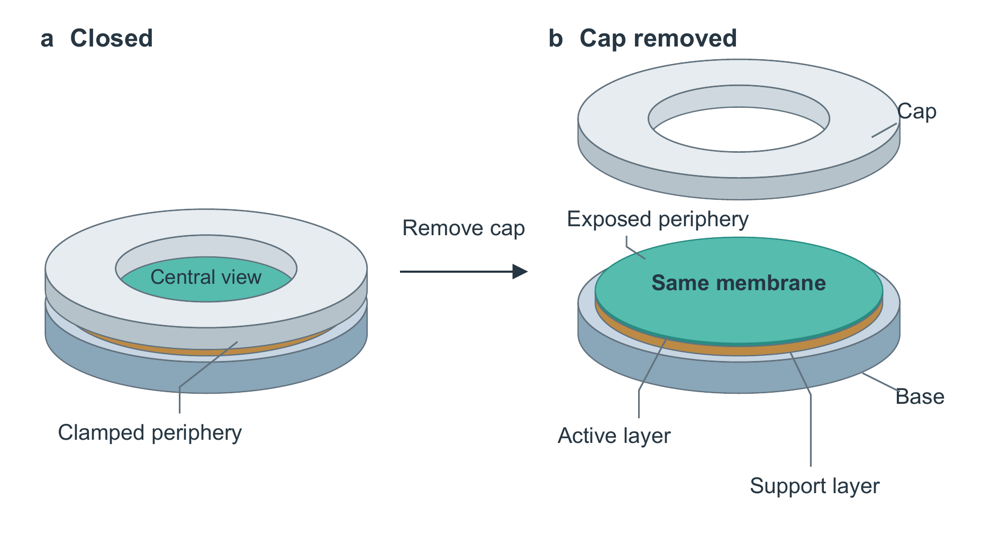
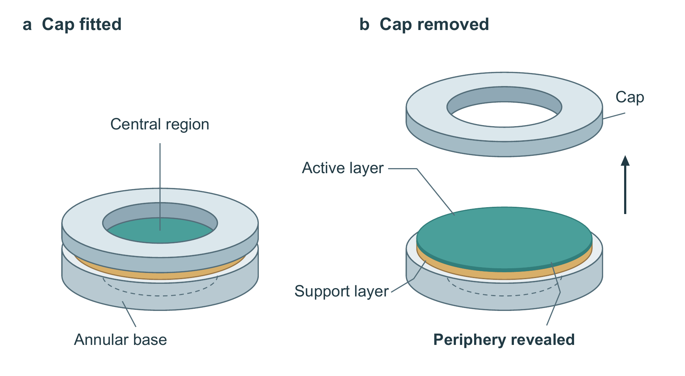

# 新材料生成：膜片观察范围的变化

[输入](input.md)是一份原创结构演示，只有部件、关系和证据边界，没有预写主旨或构图。两个独立执行上下文分别使用旧、新技能与相同绘图依赖，模型设置继承一致；每组保留首稿，最多一次自主复读。没有普通提示组、重复采样或真人参与。

新版本的[英文正文与图注](text.json)先说明观察范围的变化。图中保留同一底座与膜片，上盖单独移开；膜的两层保持贴合，底座隐蔽圆孔用虚线弧表示。没有额外剥层、流动、性能数据或真实尺寸。

| 旧技能产物 | 新技能产物 |
|---|---|
|  |  |

这两张图不用于证明版本越新就一定更好。新稿与首稿图文相同，生成者自审后保留了它；父任务只用共同排版器入稿，没有事后改画。匿名审阅的得失见[当前验收](../../tests/current-validation.md)。公开包保留新产物源码，完整首稿、旧稿与读取记录在维护任务的本地交付中。

## 重建

依赖 Python 的 `reportlab`、`Pillow`，本地 Arial 或兼容 TrueType 常规/粗体，以及 Poppler。不是读取仓库现成图片充作重建。

```powershell
python examples/membrane-observation/source.py --out output/membrane --font PATH/Arial.ttf --bold-font PATH/Arial-Bold.ttf --pdftoppm PATH/pdftoppm
```

SVG 与 PDF 为独立可编辑矢量对象；PNG 是 PDF 实际渲染。标注为 10.5–11.5 pt，图幅 160 × 88 mm。二维矢量的投影和遮挡表达层次，不是真实 3D；厚度和上盖位置不代表测量值。源码中的色觉预览只是单条件近似，不代表完整色觉覆盖或可及性认证。

检查分开记录：固定源码重建、独立上下文从新材料生成、匿名模型理解审阅、实际 Word 页面、作者认可。没有用前几项替最后一项签字，也没有将这一简单环形装置外推为复杂材料或生物插图能力。
