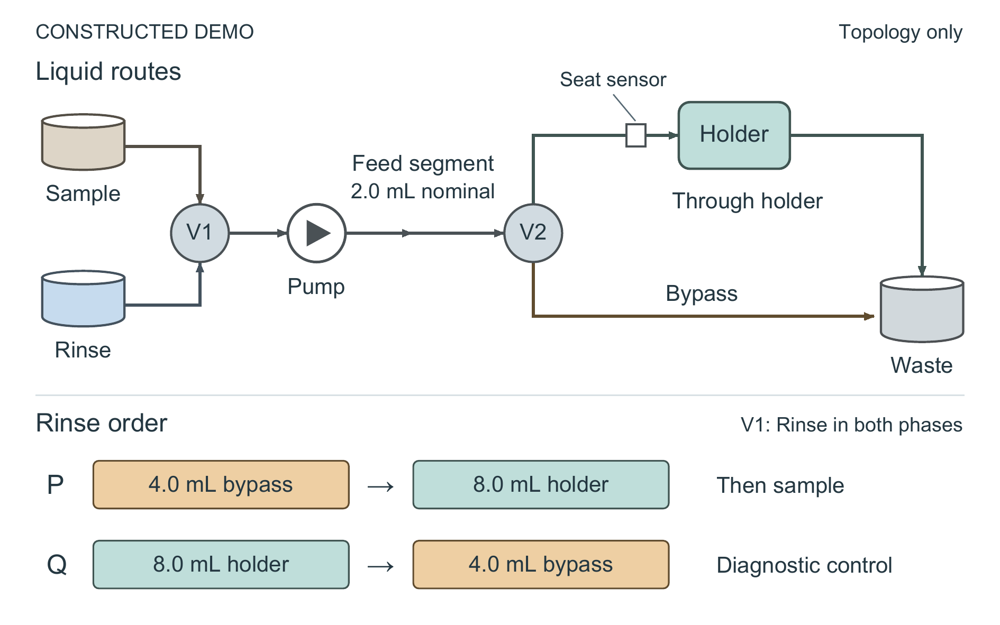

# Rinse Order in a Shared-Holder Collector: A Constructed DEMO of Volume Savings and Their Limit

*Constructed DEMO manuscript. All records are supplied illustrations, not experiments, product claims, or publishable research results.*

## Abstract

We examine a rinse sequence that first sends liquid past a reusable sample holder to waste, then rinses the holder itself. Conventional valves, pump, holder and volume measurement are retained. In constructed aqueous sequences A and B, this order meets a fixed 0.50% carryover threshold with 12.0 mL and 43 s per cycle; reversing the same two volumes at the same total time fails. A through-holder reference also passes but uses 36.0 mL and 112 s. The proposed order fails for the more persistent sequence C. The demonstration therefore identifies a conditional operating choice rather than a general reduction in rinse requirements. An acknowledgement fault separately illustrates why permission to sample must depend on confirmed valve state. Single constructed runs establish neither a physical washing mechanism nor real instrument performance.

## 1. Introduction

Successive liquid samples share one removable holder, so cleaning must prepare the instrument for the next sample without silently treating a completed command as successful cleaning. A long rinse through the holder is a simple reference, but it sends all rinse liquid along the same route. The present control change separates an initial bypass discharge from a later through-holder rinse. Its practical question is whether that order can meet an already fixed carryover requirement with less rinse and less time, and where that choice ceases to be adequate.

The exercise changes the programmed sequence, not the liquid-handling hardware. The flat porous disc, its two seals and holder, pump, two three-port selectors, flow-meter integration and gravimetric collection all predate this code. Bypassing and rinsing are conventional operations. The contribution of this DEMO is to make the ordered combination explicit and assess it against comparisons that separate total rinse quantity from order. No literature or priority claim is supplied. The diagnostic reverse-order control is particularly useful because it retains both volumes and the same total cycle time; the persistent-residual sequence tests whether a favorable result can be generalized across the supplied conditions.

## 2. Methods

### 2.1 One holder, two destinations

Figure 1 shows the hydraulic topology. V1 selects either the Sample reservoir or the distinct Rinse reservoir for a single pump. The feed segment extends from the pump outlet to V2 and has a documented nominal dead volume of 2.0 mL. V2 selects the holder inlet or a drain branch that bypasses the holder. The holder outlet and bypass both discharge to one Waste reservoir. Waste is not recirculated, and sampling and cleaning cannot occur simultaneously. A sensor at the holder inlet reports whether the holder is seated; it neither measures residual contamination nor certifies the seal.

### 2.2 Ordered rinse and guarded transitions

Protocol P selects Rinse and the bypass, delivers 4.0 mL to Waste, then keeps Rinse selected while switching V2 through the holder and delivering 8.0 mL. Sampling is permitted afterwards. The initial bypass quantity is twice the nominal feed dead volume, but that arithmetic does not establish complete replacement or identify a washing mechanism. Both quantities were fixed before the constructed records were generated. All 12.0 mL count as rinse use, including the initial discharge.

Before either selector changes, the implementation latches pump inhibit and resets the volume integrator for each new phase. The pump runs only after the selectors acknowledge their commanded states. The through-holder phase additionally requires the holder-seat signal. A missing acknowledgement stops the cycle before another pump command. These conditions make the sequence operationally definite: programmed delivery cannot continue merely because a selector command was issued. They are implementation requirements, not independently quantified inventions or a complete assurance against hardware faults.

### 2.3 Comparisons and recorded quantities

Reference L delivers 36.0 mL entirely through the holder. Bypass-only O delivers 4.0 mL through the bypass and returns to Sample without rinsing the holder. Diagnostic Q delivers 8.0 mL through the holder first and then 4.0 mL through the bypass. P_no_ack disables the acknowledgement guard solely for fault injection and is not a proposed operating mode.

Each A, B or C sequence contains 20 concentrated-sample-to-blank transitions. Carryover is blank signal divided by the immediately preceding sample signal, expressed as percent; Table 1 reports the worst value in a sequence, not its mean. The CSV supplies these percentages rather than the underlying blank and sample signals. The acceptance threshold was fixed at 0.50%. A and B are different aqueous sample labels at the same nominal flow setting. C denotes a more persistent residual in the holder without establishing its physical cause. Each sequence has one constructed run. Time includes switching and checks but excludes sample measurement; collected volume includes both discharge routes. F is a separate acknowledgement-fault sequence and has no carryover measurement.

## 3. Results

Holding rinse quantity and total time fixed separates the P/Q order comparison from a simple volume reduction. For A and B, P records worst carryover of 0.22% and 0.37%, respectively, below the 0.50% threshold. Q uses the same 12.0 mL and 43 s but records 1.31% and 1.65%. Thus total quantity alone does not describe the favorable records. These comparisons distinguish the ordered protocols as wholes; they do not establish which unmeasured transport or surface process accounts for the difference.

The L/P comparison then asks what the passing order costs. Relative to L, P reduces rinse from 36.0 to 12.0 mL, a 66.7% reduction, and cycle time from 112 to 43 s, a 61.6% reduction. L has lower worst carryover, at 0.18% and 0.25%; choosing P therefore rests on meeting the specified threshold at lower consumption and time, not on identical or superior cleaning. Bypass-only O is faster still and uses less rinse, but its 2.80% and 3.40% exceed the threshold.

Sequence C limits that choice. P reaches 1.24%, compared with 2.15% for Q and 4.10% for O, but only L, at 0.42%, meets the threshold. Lower carryover than another failing protocol is insufficient for acceptance. C cannot be renamed a verified fouling, adsorption or viscosity experiment because the source provides no such identification.

In F, the missing V2 acknowledgement occurs when changing to the through-holder rinse. Guarded P stops after 4.0 mL and 19 s, with zero completed cycles. P_no_ack continues to the programmed 12.0 mL and 43 s and records one completed cycle, meaning permission to take the next sample. The actual V2 position is unspecified, so that permission is not evidence of successful rinsing. Neither fault record supplies carryover, and neither belongs in the A/B/C cleaning comparison.

## 4. Limits and conclusion

The constructed records favor bypass-first P for A and B under the stated threshold while retaining L as the only acceptable protocol for C. The equal-quantity, equal-time reverse-order control makes sequence order worth examining in a real study, but it does not validate a physical explanation. There are no independent repeats, uncertainty estimates or significance tests. The record cannot establish equivalence, optimized phase volumes, domain-specific novelty or production readiness.

A real investigation would need physical validation and an appropriate domain baseline. Missing tubing dimensions, wetted area, contact angles, disc chemistry and pore size prevent a geometric or chemical explanation here. Leaks, welded contacts, false seated signals and valve internal carryover remain untested. The guard illustrates one specified failure exit; it does not certify seal integrity or comprehensive fault safety. The defensible outcome is an explicit rinse-order choice with a visible failure condition, supported only within this constructed DEMO.

## Table 1. Complete constructed records

| Sequence | Protocol | Rinse (mL) | Total cycle (s) | Worst carryover (%) | Transitions | Completed cycles | Collected (mL) |
|---|---|---:|---:|---:|---:|---:|---:|
| A | L | 36.0 | 112.0 | 0.18 | 20 | 20 | 36.0 |
| A | O | 4.0 | 18.0 | 2.80 | 20 | 20 | 4.0 |
| A | P | 12.0 | 43.0 | 0.22 | 20 | 20 | 12.0 |
| A | Q | 12.0 | 43.0 | 1.31 | 20 | 20 | 12.0 |
| B | L | 36.0 | 112.0 | 0.25 | 20 | 20 | 36.0 |
| B | O | 4.0 | 18.0 | 3.40 | 20 | 20 | 4.0 |
| B | P | 12.0 | 43.0 | 0.37 | 20 | 20 | 12.0 |
| B | Q | 12.0 | 43.0 | 1.65 | 20 | 20 | 12.0 |
| C | L | 36.0 | 112.0 | 0.42 | 20 | 20 | 36.0 |
| C | O | 4.0 | 18.0 | 4.10 | 20 | 20 | 4.0 |
| C | P | 12.0 | 43.0 | 1.24 | 20 | 20 | 12.0 |
| C | Q | 12.0 | 43.0 | 2.15 | 20 | 20 | 12.0 |
| F | P | 4.0 | 19.0 | — | 1 | 0 | 4.0 |
| F | P_no_ack | 12.0 | 43.0 | — | 1 | 1 | 12.0 |

*A/B/C carryover is the maximum across 20 transitions in one constructed run per sequence–protocol record. A dash is missing carryover, not zero. In F, completed cycles denote permission to sample, not verified cleaning. Total cycle time includes switching and checks and excludes sample measurement. Collected volume includes both bypass and holder discharge; it is waste, not a product yield. The original row order and all values are retained.*

## Figure 1

**Figure 1.** Constructed DEMO of the rinse topology and order comparison. V1 selects Sample or Rinse for one pump. The feed segment between the pump outlet and V2 has a nominal dead volume of 2.0 mL. V2 selects either the single holder or the bypass; both discharge to the same Waste reservoir. Arrows show permitted liquid-flow direction, not simultaneous operation. P delivers 4.0 mL through the bypass before 8.0 mL through the holder. Q reverses those quantities and is a diagnostic control. The holder-seat sensor reports presence, not cleanliness or seal integrity. The holder symbol represents one porous disc clamped between two seals; no internal geometry is specified. Shapes, distances and tubing lengths are schematic and have no physical scale.
