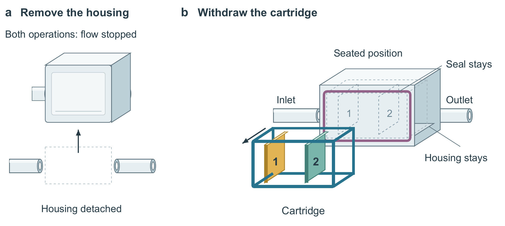

# 同一套部件，先讲清楚哪一部分移动

本例用虚构过滤组件检查图文设计，不是产品研究或性能证据。[原始材料](input.md)没有尺寸、仿真、密封测试或更换时间数据；它只给定部件与操作关系。目标是让读者理解整壳拆卸和侧向抽出滤盒的区别，再看懂固定与随动部件。不能画出流量、在线维护或效率提升。

## 三种表示的取舍

| 方案 | 获得什么 | 代价与决定 |
|---|---|---|
| 原二维状态图 | 装入和抽出状态各占一处，层序容易逐项核对 | 相同壳体重复占据画面，图形更像组件清单；它仍是关系校验的有效参照，不因平面画法而淘汰。 |
| 立体部件分开放置 | 滤层是框内的横向薄片，区别于表面色块 | 开口与部件位置没有共用抽出轴，箭头可能像从侧壁斜穿，或只是指向旁边图例。淘汰；不能靠图注解释掉错误暗示。 |
| 开口与抽出盒共用投影，原位作虚线参照 | 同一个盒的原位和移动方向直接对应；固定壳体只画一次，滤层和框有明确包含关系 | 原位描线比独立实色状态弱。初稿只留空框，丢掉装入层序，后按审阅意见恢复淡虚线层片及编号。选用此版，但不宣称它适用于所有组件。 |



原位与抽出态是同一盒的两种表示，不是两套实物。立体来自相同投影、前后遮挡和不同构件的形状；面明暗辅助区分壳体与开口，没有测量几何或真实 3D 模型。两个操作都停止流动，这一条件放在共同位置。抽出箭头避开滤层，避免被读作层间流动。

这次改图增加了装入态参照、恢复必要标签，没有用减字比例作为胜出理由。原二维图在状态分离方面仍有优势；新图改善了包含关系和抽出方向，但传统壳体的右接口受透视遮挡，更需结合管段理解。

## 图、图注和正文分别做什么

原段逐项列出壳体、接口、密封圈、框和两层材料。改稿先讲操作改变：不用拆掉管路连接的壳体，抽出的是带两层滤材的框；随后说明它要求同时保持层序和密封圈归属。[正文文件](text.json)保存原文、改文、证据边界及图注。

图直接表示谁固定、谁移动、层片包含与层序；图注解释虚线、箭头和示意比例；正文交代设计目的与证据范围。两段都保留“有位置检查的描述、没有源模型或日志、没有性能验证”，不把绘图漂亮当成研究成立。

## 重建

Python 依赖 `reportlab`、`python-docx`；位图导出需要 Poppler 的 `pdftoppm` 和本机可用的常规/粗体 TrueType 字体。路径显式传入，不要求特定机器。SVG/PDF 的图元、文字仍可编辑，PNG 用于预览和 Word 回退；程序是这个固定案例的源码，不是套用到每项研究的模板。

```powershell
python examples/visual-editorial/build_figure.py --out output/cartridge --font PATH/Arial.ttf --bold-font PATH/Arial-Bold.ttf --pdftoppm PATH/pdftoppm --view spatial
python examples/visual-editorial/build_document.py --figure-dir output/cartridge --out output/cartridge-page
```

每次换新输出目录，保留旧结果。加 `--view separated` 可以重建被拒绝的构图作教学比较；其清单会明确标为拒绝，不能拿它作最终图。原二维图属于 FigureCraft 的 `examples/filter-cartridge`，比较时按同样 160 mm 宽度查看。

`build_document.py` 生成清稿和黄色稿，黄色仅表示本例相对输入段落的改写，不是原生修订。用宿主 documents 渲染器重新打开清稿与黄稿，查看确切页面；仅执行这两个脚本不等于完成视觉验收。示例不含公式、表格或文献，不能用它证明复杂 Word 保真或完整论文质量。

## 验证范围

开发过程保留首稿和后续修复。独立模型读取实际图片后指出原位层序丢失、共同停流条件不明确；这是外部意见后的修复，不计为一次生成自主完成。已检验的是一个固定结构案例及其入稿路径；新的结构任务另行生成和审阅，结果见[当前验收](../../tests/current-validation.md)。没有真人审美认可，也没有“Nature 水平认证”。
