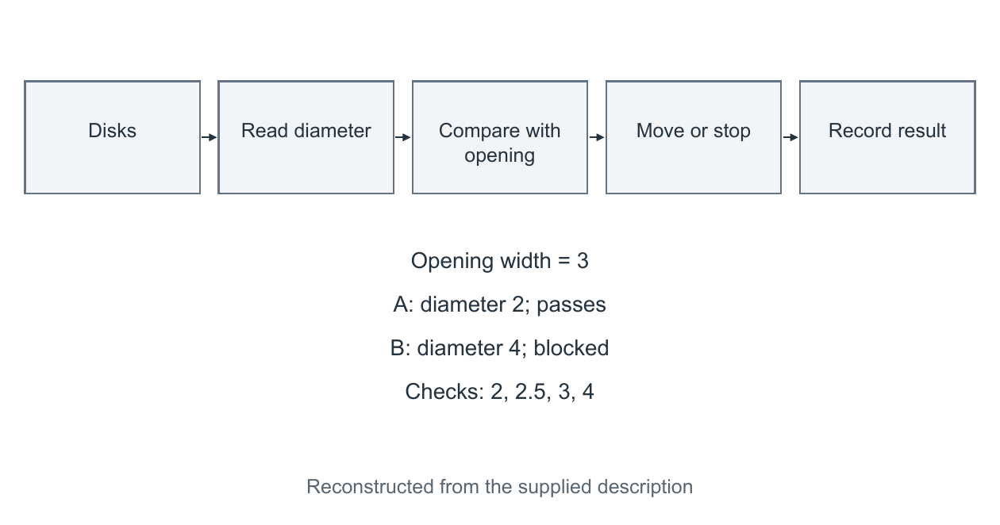

# 完整前后对照

## 旧段：76 个 Latin tokens

We define a rigid wall with a centered opening of width 3. Disk A has diameter 2 and disk B has diameter 4. Their centers approach along the opening midline. The implementation compares each diameter with 3. It accepts values below 3 and rejects values equal to or above 3. Four tests use diameters 2, 2.5, 3 and 4. Elasticity, friction and adhesion are omitted. The accepted disk moves right and the rejected disk remains left. This model has an input, a comparator and two outputs.

旧图仅有文字描述；上图是重建，不是截图。

## 候选 P1：入口，36 个 Latin tokens

One fixed aperture admits disk A and blocks disk B solely by their diameters (Fig. 1). In this ideal two-dimensional DEMO, the opening width is 3, while the diameters are 2 and 4. Passage requires d < 3; even equality is blocked.

## 候选 P2：方法与构造检查，60 个 Latin tokens

Both rigid disks approach the rigid barrier from left to right along the opening centerline. Constructed checks at d = 2, 2.5, 3, and 4 return pass, pass, block, and block; these cover the threshold and its boundary, not statistical variation. The model omits elasticity, friction, adhesion, forces, and clogging dynamics. It supplies no efficiency, throughput, or probability evidence and proposes no new sieving law.

## 候选 C1：图注，54 个 Latin tokens

Figure 1. Geometric outcomes at the same aperture (constructed DEMO). Disk diameters and opening width share one scale; lengths are in arbitrary units. A is placed downstream to show passage, while B contacts the opening edges and remains upstream. Arrows indicate left-to-right approach and passage, not measured trajectories. The rule is strict: d = 3 is blocked.

## 比较口径

Latin tokens 按字母词组计数，A/B/d 等标识符计入，数字另计。P1 + P2 为 96，大于旧段 76。36 只描述入口，不代表整篇减字；改善是把两种结果及共同原因置于首句，独有检查和证据边界由实际 P2 承接。图注不承担所有模型细节。
