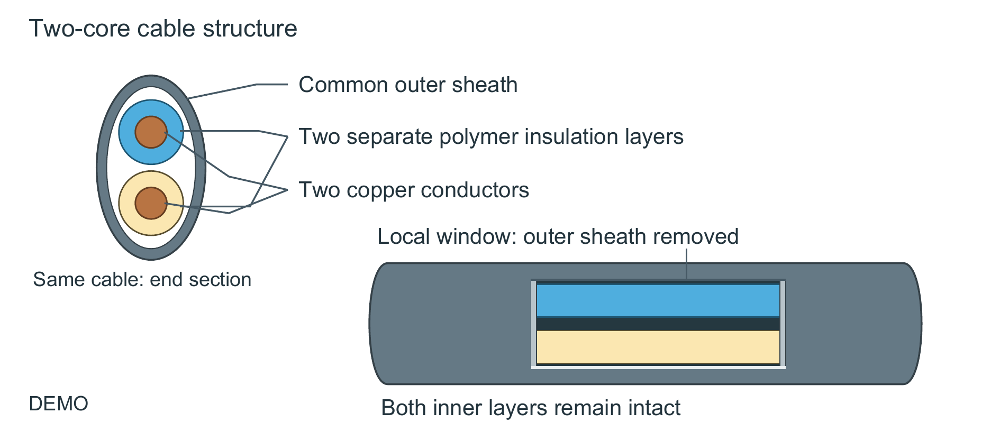
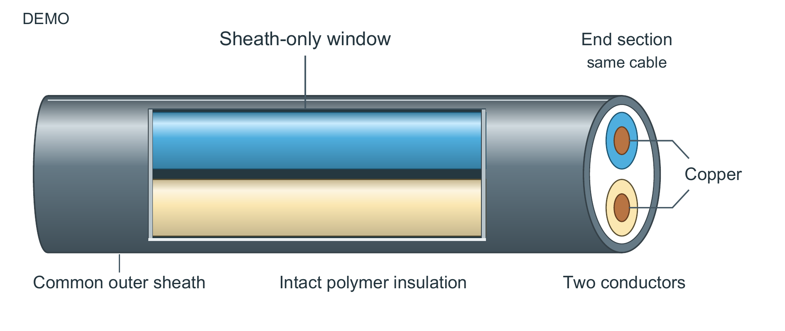

# 两芯电缆：从材料清单到操作与不变量

这是本次原创结构 DEMO，不是实验或研究创新。before 是为本次比较构造的普通组织版本，不是用户历史作品。原始事实见 brief.json；不增减两芯、独立绝缘、共同护套、仅打开外层等条件。

文字见 [原段](method-before.md)、[改段](method-after.md) 与 [图注](caption-and-alt.md)。原段从材料清单开始，第六句才交代开窗；改段先说“只打开外护套，内层保持完整”，再解释层级。没有假装获得性能证据。

图形将分离的端面与局部窗口接到同一个连续主体上，借轮廓和遮挡表达包含关系。端面是同一对象的重复视图；窗口内不画铜截面。颜色区分两层绝缘，浅明暗表达曲面，端面平色表示截面。这些是选择依据，不是所有题材的默认模板。

共同尺寸为 160 × 67.56 mm。细部端面比原来的正面圆形更窄，是明确代价，因此保留铜芯引线。主标签约 10.08–11.09 pt，DEMO 和 same cable 约 9.07 pt。已查看正常色、灰度和一个色觉模拟条件；科学审阅仅覆盖给定事实，模型阅读评估不等于人类读者试验或作者认可。

本例由独立执行上下文读取新版技能和必要事实后生成，未读取 SegQ 的稿件、图或改法。仍由编辑复核，不能据此把全部改善归因于技能，或外推为所有论文都有效。任意 SVG 辅助标签审计未覆盖 opacity/tspan 等特性，保留待审；原生引擎及有限图元检查另行执行。直接 SVG 浏览器预览未执行，视觉检查来自实际 PDF 导出。几何是可编辑矢量 2.5D，不是真实 3D。

图源已附 SVG/PDF；完整生成脚本位于 FigureCraft 的 examples/cable-window。本文字示例不依赖绘图技能才能阅读。
